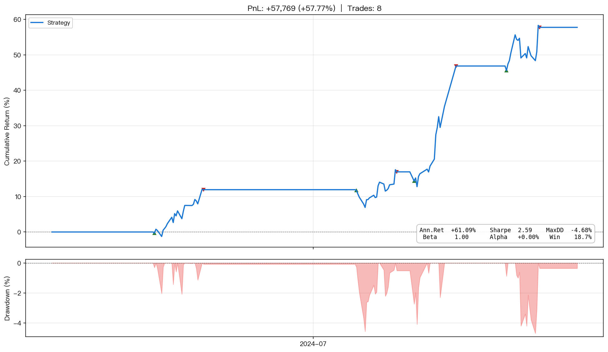
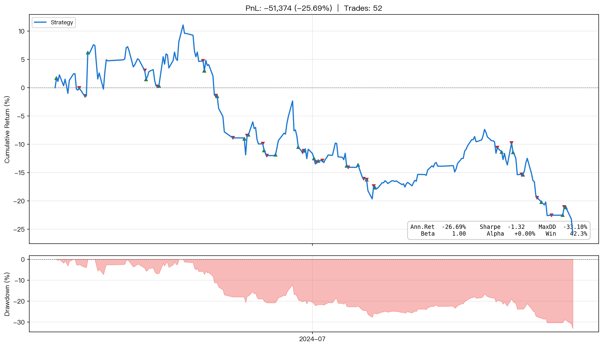
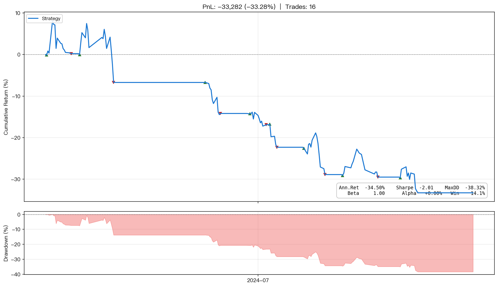

<div align="center">

<a href="https://github.com/AlanFokCo/EasyQuant"></a>

# EasyQuant

面向中国 A 股市场的事件驱动量化回测框架。

[](https://github.com/AlanFokCo/EasyQuant/actions/workflows/test.yml)
[](https://AlanFokCo.github.io/EasyQuant/)
[](https://www.python.org)
[](https://github.com/AlanFokCo/EasyQuant/blob/main/LICENSE)
[](https://github.com/AlanFokCo/EasyQuant/releases)

<p>
<a href="https://github.com/AlanFokCo/EasyQuant/blob/main/README.md">English</a> ·
<a href="https://AlanFokCo.github.io/EasyQuant/">在线文档站</a> ·
<a href="tutorials/README.md">新手教程</a> ·
<a href="doc/README.md">文档中心</a> ·
<a href="doc/api_reference.md">API 参考</a> ·
<a href="examples/Examples.md">示例</a> ·
<a href="doc/FAQ.md">常见问题</a>
</p>

</div>

---

## 功能特性

- **事件驱动回测** — `initialize` → `run_daily` → `handle_data`，与 JoinQuant / Zipline 一致的编程模型
- **A 股数据** — 日线 OHLCV、分钟 K 线、Tick 数据、实时行情、财务摘要、资金流向，通过 AKShare 免费获取
- **仓位管理** — 按股数 / 金额 / 目标值买卖，自动取整到 100 股，自动计算手续费
- **风险分析** — 夏普 / 索提诺 / 最大回撤 / alpha & beta / Brinson 归因 / Fama-French 因子分析
- **组合优化** — 最小方差、最大夏普、风险平价
- **模拟盘** — 使用实时行情持续运行策略，实盘前验证
- **PTrade/QMT 适配** — 策略一键导出为券商平台格式
- **选股** — 按因子定期调仓（ST/PB/PE/动量过滤、Top-N、多因子评分）
- **工具库** — 30+ 技术指标（MA、MACD、RSI、KDJ、布林带、ATR、ADX）、统计分析、仓位管理（Kelly、ATR、固定比例）
- **报告输出** — 交互式 HTML 报告、图表 PNG、Markdown、JSON，含 20+ 风险/收益指标
- **链式选股 API** — 流式接口（`query` / `valuation` / `get_fundamentals`）用于基本面筛选

---

## 快速开始

```bash
# PyPI 安装（推荐，无需克隆仓库）
pip install easyquant-eqlib

# 或从源码安装（开发者 / 贡献者）
git clone https://github.com/AlanFokCo/EasyQuant.git
cd EasyQuant
pip install .
```

验证安装并运行第一个回测：

```bash
python -c "from eqlib import *; print('eqlib OK')"
python examples/03_run_backtest.py  # 需在仓库目录运行
```

在 `reports/` 目录打开最新生成的 `.html` 报告。

> **新手提示：** 如果你更喜欢浏览器界面，可以使用 [Web 策略工作室](web_strategy_studio/) — 无需安装 Python 环境，打开浏览器即可编写策略、运行回测、查看报告。详见 [Web 工作室文档](doc/web_studio.md)。

### 编写第一个策略

```python
from eqlib import *

def initialize(context):
    g.security = '601390'
    set_benchmark('000300.XSHG')
    run_daily(market_open, time='every_bar')

def market_open(context):
    hist = attribute_history(g.security, 20, '1d', ['close'])
    ma20 = hist['close'].mean()
    price = hist['close'].iloc[-1]

    if price > ma20 * 1.02:
        order_value(g.security, context.portfolio.available_cash)
    elif price < ma20 * 0.98 and context.portfolio.positions.get(g.security):
        order_target(g.security, 0)

result = run_strategy(
    initialize,
    start_date='2024-01-01',
    end_date='2024-12-31',
    starting_cash=100000,
    securities=['601390'],
)
```

> **订单执行模型：** `order*` 系列 API 在当前回调里只是下单，实际按**下一个交易日开盘价**成交（避免前视偏差）。
>
> **输出结果：** 运行后会在 `reports/` 生成 `.png`、`.html`、`.md`、`.json` 四类文件。优先在浏览器打开 `.html` 查看完整报告。

---

## 报告预览

`run_strategy` 生成**交互式 HTML 报告**（可在任意浏览器打开），同时输出 PNG、Markdown 和 JSON。以下为真实回测结果截图。

### 盈利策略

| MACD 趋势 + 成交量 (600536) | 布林带均值回归 (601088) | 支撑/阻力位 (8 只股票) |
|:---:|:---:|:---:|
| **+103.48%** · 16 笔 | **+57.77%** · 8 笔 | **+119.97%** · 171 笔 |
| [](tutorials/assets/example_report_macd_volume.png) | [](tutorials/assets/example_report_bollinger.png) | [](tutorials/assets/example_report_sr_strategy.png) |

### 亏损策略（用于学习）

| 动量组合 (5 只股票) | 本地数据 (000768) |
|:---:|:---:|
| **−25.69%** · 52 笔 | **−33.28%** · 16 笔 |
| [](tutorials/assets/example_report_portfolio.png) | [](tutorials/assets/example_report_19_localdata.png) |

### HTML 报告（交互式）


> **如何阅读报告：** 页面依次展示：头部摘要 → 指标卡片（夏普、最大回撤、alpha）→ K 线图（含 MA/RSI/MACD/布林带）→ 累计收益 vs 基准 → 回撤曲线 → 每日盈亏 → 交易/持仓标签页。完整指南：[报告与指标详解](doc/reports_and_metrics.md)。

---

## 项目结构

```
EasyQuant/
├── eqlib/                 # 核心库（回测引擎、数据 API、分析工具）
├── agent/                 # AI 优化工具
│   ├── optimizer.py       # 规则参数搜索（参考）
│   ├── audit_log.py       # 结构化 JSONL + Markdown 审计日志
│   └── strategy_template.py  # 参数化策略模板
├── examples/              # 24 个可运行示例脚本
├── tutorials/             # 分步学习教程
│   └── prerequisites/     # Python、技术分析、A 股基础
├── doc/                   # 用户手册、API 参考、FAQ
├── docs/                  # GitHub Pages 文档站源文件（MkDocs Material）
├── tests/                 # 测试套件
├── assets/                # 品牌素材（Logo、图标）
├── web_strategy_studio/   # Web 策略工作室（浏览器端策略开发）
│   ├── backend/           # FastAPI 后端
│   ├── frontend/          # React + Vite 前端
│   └── docker-compose.yml # Docker 一键部署
├── CLAUDE.md              # AI 代理配置与优化工作流
└── mkdocs.yml             # 文档站配置
```

## 示例

完整索引见 [`examples/Examples.md`](examples/Examples.md)。

| # | 文件 | 说明 |
|---|------|------|
| 01 | `01_fetch_data.py` | 数据 API：历史行情、CSV、本地加载、市场扫描 |
| 02 | `02_write_strategy.py` | 策略编写模板（均线交叉、RSI、多股轮动） |
| 03 | `03_run_backtest.py` | 端到端回测 + 报告输出 |
| 04 | `04_stock_screener.py` | 实时选股扫描 |
| 05 | `05_paper_trade.py` | 模拟盘交易 |
| 06 | `06_advanced_api.py` | 调度、组合优化、归因分析 |
| 07 | `07_market_data.py` | 财务、行业、指数、分钟线、Tick 数据 |
| 08 | `08_lifecycle_callbacks.py` | 生命周期回调与股票池管理 |
| 09 | `09_attribution_analysis.py` | Brinson 归因 + Fama-French 因子分析 |
| 10 | `10_index_concept.py` | 指数与概念板块策略 |
| 11 | `11_utils_library.py` | 全量工具库演示 |
| 12 | `12_portfolio_backtest.py` | 多股票组合回测 |
| 13 | `13_ptrade_export.py` | 导出 PTrade/QMT 策略 |
| 14–17 | 策略示例 | 布林带、MACD+成交量、多因子、网格交易 |
| 18 | `18_strategy_comparison.py` | 多策略横向对比 |
| 19 | `19_local_data_backtest.py` | 本地数据模式（下载一次，离线回测） |
| 20 | `20_sr_strategy/` | 支撑阻力位组合（完整实盘案例） |
| 21 | `21_combined_strategy/` | 全天候 Alpha 综合策略 |
| 22 | `22_stock_selection_strategy.py` | 定期选股调仓 |
| 23 | `23_small_cap_query_example.py` | 小市值链式筛选 |
| 24 | `24_quick_report_test.py` | 快速验证报告格式 |

---

## 文档

| 资源 | 说明 |
|------|------|
| [**在线文档站**](https://AlanFokCo.github.io/EasyQuant/) | 完整文档站，支持搜索、暗色主题、导航 |
| [**文档中心**](doc/README.md) | 入口：用户手册、API 索引、FAQ、报告指标详解 |
| [**用户手册**](doc/user_guide.md) | 安装 → 编写策略 → 运行回测 → 解读报告 |
| [**Web 策略工作室**](doc/web_studio.md) | 浏览器端策略开发，无需安装 Python 环境 |
| [**API 参考**](doc/api_reference.md) | 全部公开 API 的参数与示例 |
| [**工具库参考**](doc/utils_reference.md) | 技术指标、统计分析、仓位管理 |
| [**新手教程**](tutorials/README.md) | 从零基础到实盘部署，含真实策略案例 |
| [**报告与指标详解**](doc/reports_and_metrics.md) | 报告逐屏解读、指标全字段说明 |
| [**常见问题**](doc/FAQ.md) | 安装、数据、性能、排错 |

---

## 安装

```bash
git clone https://github.com/AlanFokCo/EasyQuant.git
cd EasyQuant
pip install .
```

开发模式安装：

```bash
pip install -e ".[dev]"
python -m pytest tests/ -v
```

**环境要求：** Python 3.10+ · macOS / Linux / Windows

---

## 性能

- **内存感知数据加载** — 自动限制内存用量（默认 1 GB），超出时引擎切换为紧凑切片模式，结果完全一致
- **快速 I/O** — 内存中直接读取 `attribute_history`，将 6 年以上回测从约 20 分钟缩短至约 1 分钟
- **并行数据加载** — 多线程预加载，加快启动速度

---

## 贡献

欢迎贡献代码！请先阅读 [CONTRIBUTING.md](CONTRIBUTING.md) 了解指南。

### 开发环境

```bash
pip install -e ".[dev,docs]"
python -m pytest tests/ -v
```

### CI/CD

| 流水线 | 触发条件 | 说明 |
|--------|---------|------|
| [Tests](https://github.com/AlanFokCo/EasyQuant/blob/main/.github/workflows/test.yml) | 推送 / PR 到 `main` | 在 Python 3.10、3.11、3.12 上运行测试 |
| [Deploy Docs](https://github.com/AlanFokCo/EasyQuant/blob/main/.github/workflows/deploy-docs.yml) | 推送文档文件到 `main` | 构建并部署 MkDocs 站点到 GitHub Pages |

---

## 许可证

本项目基于 [MIT 许可证](https://github.com/AlanFokCo/EasyQuant/blob/main/LICENSE) 开源。

---

> **免责声明：** 本项目仅供学习研究使用，不构成投资建议。
