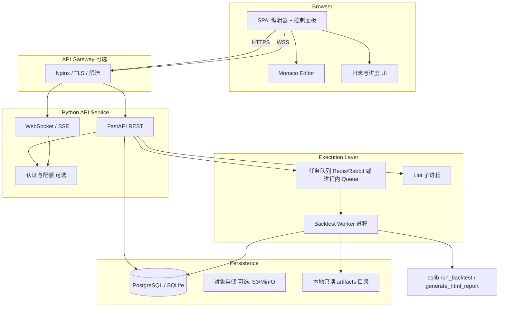
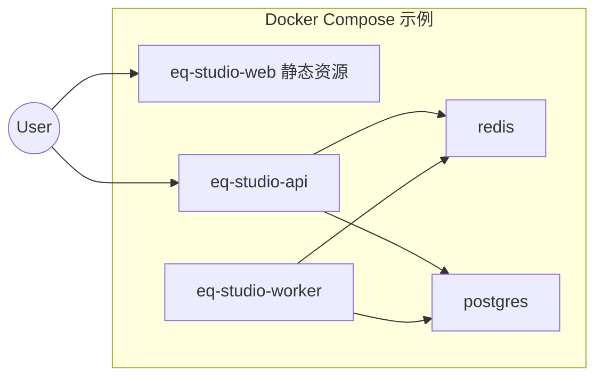
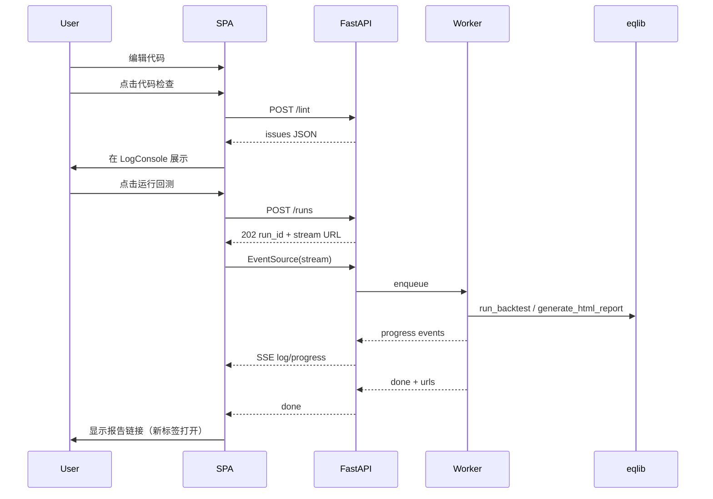

# EasyQuant Web 策略编辑与回测服务 — 技术规格说明书（Design Spec）

| 属性 | 值 |
|------|-----|
| 文档版本 | 0.1-draft |
| 适用仓库 | EasyQuant / `eqlib` |
| 状态 | 供开发团队评审与实现 |

---

## 0. 执行摘要

本文档定义在 **EasyQuant** 量化框架之上新增的 **前后端分离 Web 服务**：用户在浏览器中编写基于 `eqlib` API 的 Python 策略、执行静态检查、异步运行回测、实时查看日志与进度，并在完成后跳转到与现有 **`generate_html_report`** 风格一致的 HTML 报告。

**与现有代码库的关系**：

- **核心回测逻辑**仍由 `eqlib` 的 `run_backtest` / `run_strategy` 等提供；Web 服务不 fork 引擎，仅通过 **受控子进程或隔离 Worker** 调用。
- **HTML 报告**继续由 `eqlib.report.generate_html_report(result, out_path)` 生成；前端通过 **静态资源 URL** 打开报告页面。
- 仓库当前 **无** 既有 SPA 技术栈；前端技术选型以 **与现有 HTML 报告视觉一致**、工程成熟度与 Monaco 生态为准。

---

## 1. 项目背景与目标

### 1.1 背景

EasyQuant 是面向中国 A 股的事件驱动回测框架，策略以 Python 模块形式编写（`initialize` + `run_daily(..., market_open)` 等）。用户目前主要在本地 IDE 中编辑并运行示例脚本。

### 1.2 目标

提供 **独立可部署** 的 Web 应用，使非本地环境用户也能完成「编辑 → 检查 → 回测 → 读报告」闭环，并满足：

- 与 `eqlib` 版本兼容、可随 `pyproject.toml` 锁定依赖。
- 对用户提交代码具备 **沙箱、超时与资源上限**。
- 日志与进度 **可观测**、失败 **可诊断**。

### 1.3 非目标（首期可明确排除）

- 在浏览器内直接执行 Python（WASM Pyodide 跑全量 `akshare`+回测）—— 数据与算力模型复杂，首期不做。
- 完整量化 IDE（多文件工程、Git、协作编辑）—— 可作为后续阶段。
- 实盘下单通道 —— 与回测服务解耦，需单独风控与合规设计。

---

## 2. 现有 EasyQuant 架构调研摘要

### 2.1 后端与包结构

- **包名**：`eqlib`（`pyproject.toml` 中 `[project]` name）。
- **策略入口**：`run_backtest(initialize_func, start_date, end_date, ...)`；高层封装 `run_strategy(...)` 会在回测后调用 `generate_chart`、`generate_html_report`、`generate_report_md`、`generate_report_json` 并写入 `report_dir`。
- **典型策略形态**：单文件内定义 `initialize`、`market_open` 等；`from eqlib import *` 在示例中常见。

### 2.2 HTML 报告前端风格（须对齐）

报告由 `eqlib/report.py` 内嵌 `_HTML_TEMPLATE` 生成，设计特征如下（Web Studio UI 应复用同一 **设计 token**，保证品牌一致）：

| Token / 模式 | 值 / 说明 |
|----------------|-----------|
| 页面背景 `--bg` | `#f0f2f5` |
| 卡片 `--card` | `#fff`，圆角约 `4px`，阴影 `0 1px 4px rgba(0,0,0,.08)` |
| 主色 `--primary` | `#1890ff`（Ant Design 蓝） |
| 涨跌色（A 股习惯） | 涨 `#f5222d`，跌 `#52c41a`（与模板一致，勿自行反转） |
| 正文 `--text` / 次级 `--text-secondary` / 弱化 `--text-dim` | `#262626` / `#595959` / `#8c8c8c` |
| 字体栈 | `-apple-system, BlinkMacSystemFont, "Segoe UI", "PingFang SC", "Hiragino Sans GB", "Microsoft YaHei", sans-serif` |
| 图表 | TradingView **lightweight-charts** CDN（报告已引用 4.1.1） |

Studio 自身页面建议使用 **CSS 变量** 同名映射上述变量；按钮、面板、日志区布局与报告中的 `.header` / `.card` / `.section` 气质保持一致。

### 2.3 现有「前端技术栈」结论

- 产品侧前端主要为 **服务端生成的静态 HTML + 内联 CSS + 少量原生 JS**。
- **无** 现成 Vue/React 工程；新服务可自由选择栈，但须在 UI 规范上 **显式对齐** 上表。

---

## 3. 系统架构设计

### 3.1 逻辑架构图



### 3.2 部署架构（推荐）



- **首期最小集**：`api` + `worker` 合并为单进程（asyncio），SQLite 单文件；仍保留接口抽象便于拆分。
- **生产推荐**：API 与 Worker 分离 + Redis 队列 + PostgreSQL；报告 HTML 写入共享卷或对象存储，通过 Nginx `alias` 提供静态访问。

### 3.3 技术栈选型及理由

| 层级 | 选型 | 理由 |
|------|------|------|
| 前端框架 | **React 18 + TypeScript + Vite** | 生态成熟；与 Monaco/React 集成文档丰富；EasyQuant 无历史包袱。备选：Vue 3 + Vite（同等可行）。 |
| 编辑器 | **Monaco Editor** | Python 语法高亮、Minimap、主题与 VS Code 一致；可接入 LSP 或自研补全。 |
| 代码格式化 | **Black**（服务端）或 Monaco 内置 **Prettier**（若引入 Pyright 的 format 需评估） | 策略代码为 Python；Black 与科学计算代码库兼容性好。 |
| 静态检查 | **Ruff**（lint）+ **Pyflakes/compile**（语法） | Ruff 极快、可 JSON 输出；规则集可配置。可选叠加 **mypy --strict** 作为「高级检查」开关。 |
| 补全 | **混合方案**（见 §7.3） | 纯浏览器无法解析 `eqlib` 完整类型；建议 Monaco 注册 **eqlib 符号 JSON** + 可选 **pyright language server**（Worker 侧）。 |
| 后端框架 | **FastAPI** | 异步原生、OpenAPI 文档自动生成、WebSocket 支持。 |
| 任务队列 | **MVP：asyncio + Redis Streams**；扩展：**Celery** | 需求书建议 Celery；MVP 可用 Arq/RQ/Celery 任一，接口抽象 `TaskBackend`。 |
| 实时日志 | **WebSocket**（双向，可扩展取消任务）或 **SSE**（单向，实现简单） | 回测仅需服务端推送时 SSE 足够；若需「中断回测」选 WebSocket。 |
| 数据库 | **PostgreSQL**（生产）/ **SQLite**（开发） | 存策略版本、运行历史、审计日志。 |
| 容器 | **Docker + docker-compose** | 满足独立部署与资源 cgroup。 |

### 3.4 模块划分

| 模块 | 职责 |
|------|------|
| `studio-web` | SPA：编辑器、参数表单、日志、进度、报告链接。 |
| `studio-api` | REST：策略 CRUD、检查、提交回测、查询任务状态；WS/SSE：日志流。 |
| `studio-worker` | 消费任务：准备临时 `.py` → 沙箱执行 → 写报告路径 → 更新 DB。 |
| `studio-sandbox` | 封装 `subprocess` / `docker run`、超时、内存与 CPU 限制、环境变量注入。 |
| `studio-lint` | 调用 ruff/mypy，解析结果为统一 JSON schema。 |
| `studio-completion`（可选） | 维护 `eqlib` 导出符号表、docstring 片段，供 REST `POST /completion` 或 LSP 使用。 |

---

## 4. API 设计

### 4.1 通用约定

- **Base URL**：`/api/v1`
- **Content-Type**：`application/json`；文件上传场景使用 `multipart/form-data`
- **错误格式**：

```json
{
  "error": {
    "code": "VALIDATION_ERROR",
    "message": "人类可读说明",
    "details": [{ "field": "start_date", "issue": "invalid format" }]
  }
}
```

- **Idempotency**：`POST /runs` 支持可选头 `Idempotency-Key: <uuid>`，防止重复提交。

### 4.2 策略（Strategy）资源

#### `POST /strategies`

创建策略（首版可为「单用户单命名空间」省略 `owner_id`）。

**Request**

```json
{
  "name": "我的双均线",
  "description": "可选",
  "source_code": "from eqlib import *\n...",
  "default_params": {
    "start_date": "2024-01-01",
    "end_date": "2024-12-31",
    "starting_cash": 100000,
    "benchmark": "000300.XSHG"
  }
}
```

**Response `201`**

```json
{
  "id": "strat_01JQ...",
  "name": "我的双均线",
  "version": 1,
  "created_at": "2026-05-11T12:00:00Z"
}
```

#### `GET /strategies/{strategy_id}`

返回最新版本源码与元数据。

#### `PATCH /strategies/{strategy_id}`

更新源码；每次保存 `version += 1`（或显式 `POST /strategies/{id}/versions`）。

#### `GET /strategies/{strategy_id}/template`

返回服务端内置 **策略壳**（与 `examples/03_run_backtest.py` 结构对齐的占位符），供前端「新建策略」一键填入。

**Response**

```json
{
  "source_code": "# 模板字符串...\n",
  "hints": [
    "必须定义 initialize(context)",
    "使用 run_daily(market_open, time='every_bar') 注册每日逻辑"
  ]
}
```

### 4.3 代码检查

#### `POST /strategies/{strategy_id}/lint`  
（或无持久化策略时：`POST /lint` + body 内联 `source_code`）

**Request**

```json
{
  "source_code": "...",
  "profile": "fast"
}
```

`profile`: `fast`（仅语法+ruff 核心规则）| `strict`（+ mypy 若有类型存根）。

**Response `200`**

```json
{
  "ok": false,
  "syntax_errors": [
    { "line": 12, "col": 3, "message": "invalid syntax", "severity": "error" }
  ],
  "lint_issues": [
    {
      "code": "F401",
      "line": 2,
      "col": 1,
      "message": "'numpy' imported but unused",
      "severity": "warning"
    }
  ],
  "security_notes": [
    {
      "code": "EQ-BANNED-IMPORT",
      "line": 1,
      "message": "Import 'subprocess' is not allowed in user strategies"
    }
  ]
}
```

**说明**：`security_notes` 由自定义 AST 遍历生成（ banned imports / `open()` 路径越界等），与 ruff 互补。

### 4.4 回测任务

#### `POST /runs`

**Request**

```json
{
  "strategy_id": "strat_01JQ...",
  "source_code": "可选，若省略则用服务器已保存版本",
  "params": {
    "start_date": "2024-01-01",
    "end_date": "2024-06-30",
    "starting_cash": 100000,
    "benchmark": "000300.XSHG",
    "use_local": false,
    "report_dir": null
  }
}
```

**Response `202`**

```json
{
  "run_id": "run_01JQ...",
  "status": "queued",
  "poll_url": "/api/v1/runs/run_01JQ...",
  "ws_url": "/api/v1/runs/run_01JQ.../stream"
}
```

#### `GET /runs/{run_id}`

**Response**

```json
{
  "run_id": "run_01JQ...",
  "status": "running",
  "progress": 0.35,
  "stage": "fetch_data",
  "started_at": "...",
  "finished_at": null,
  "artifacts": {
    "html_report_url": null,
    "json_report_url": null
  },
  "error": null
}
```

`status` 枚举：`queued` | `running` | `succeeded` | `failed` | `cancelled`  
`stage` 建议值：`validate` | `fetch_data` | `simulate` | `report`（Worker 各阶段打点）。

#### `POST /runs/{run_id}/cancel`

取消排队中或运行中任务（需 Worker 协作，如子进程 SIGTERM）。

### 4.5 补全（若不做全量 LSP）

#### `POST /completion`

**Request**

```json
{
  "source_code": "全文或当前文件",
  "cursor_line": 10,
  "cursor_col": 15
}
```

**Response**

```json
{
  "suggestions": [
    {
      "label": "attribute_history",
      "kind": "function",
      "insert_text": "attribute_history(${1:security}, ${2:5}, '1d', ['close'])",
      "insert_text_format": "snippet",
      "documentation": "获取历史行情..."
    }
  ]
}
```

实现可采用：光标前 **正则上下文** + **静态符号表**（从 `eqlib/__init__.py` 导出名生成）；进阶再换 Pyright。

### 4.6 WebSocket / SSE 事件（日志与进度）

**推荐 URI**：`GET /api/v1/runs/{run_id}/stream`  
- **SSE**：`Content-Type: text/event-stream`，事件名 `log` | `progress` | `done` | `error`。

**SSE 事件示例**

```
event: log
data: {"ts":"2026-05-11T12:01:01Z","stream":"stdout","line":"Loading ..."}

event: progress
data: {"progress":0.2,"stage":"fetch_data","message":"601390 OHLCV"}

event: done
data: {"status":"succeeded","artifacts":{"html_report_url":"/static/reports/run_01JQ....html"}}
```

若使用 **WebSocket**，JSON 帧：

```json
{ "type": "log", "payload": { "stream": "stderr", "line": "..." } }
{ "type": "progress", "payload": { "progress": 0.5, "stage": "simulate" } }
{ "type": "done", "payload": { "run_id": "...", "artifacts": { ... } } }
```

**背压**：服务端队列每条运行最多保留最近 N 条（如 2000）日志在内存，超出写文件 tail；前端虚拟列表渲染。

---

## 5. 数据库设计

### 5.1 ER 概览

- `users`（可选）  
- `strategies`  
- `strategy_versions`（每次保存一条，可 diff）  
- `runs`  
- `run_logs`（大文本可外置对象存储，表中仅存路径）

### 5.2 表结构（PostgreSQL 风格）

#### `strategies`

| 列 | 类型 | 说明 |
|----|------|------|
| id | UUID PK | |
| owner_id | UUID FK nullable | 单租户可 null |
| name | TEXT | |
| description | TEXT | |
| created_at | TIMESTAMPTZ | |
| updated_at | TIMESTAMPTZ | |
| current_version | INT | 冗余最新版本号 |

#### `strategy_versions`

| 列 | 类型 | 说明 |
|----|------|------|
| id | UUID PK | |
| strategy_id | UUID FK | |
| version | INT | 从 1 递增 |
| source_code | TEXT | 完整源码 |
| created_at | TIMESTAMPTZ | |

#### `runs`

| 列 | 类型 | 说明 |
|----|------|------|
| id | UUID PK | |
| strategy_id | UUID FK | |
| strategy_version | INT | 冻结版本 |
| status | TEXT | 枚举 |
| progress | REAL | 0–1 |
| stage | TEXT | |
| params | JSONB | 回测参数 |
| error_code | TEXT | |
| error_message | TEXT | |
| html_path | TEXT | 服务器内路径或 URL |
| json_path | TEXT | |
| started_at / finished_at | TIMESTAMPTZ | |
| worker_hostname | TEXT | 可选，运维 |

#### `run_logs`（可选分表）

| 列 | 类型 | 说明 |
|----|------|------|
| run_id | UUID FK | |
| seq | BIGSERIAL | 顺序 |
| stream | TEXT | stdout/stderr/engine |
| line | TEXT | |

大流量场景改为 **追加写文件** `artifacts/{run_id}.log`，DB 仅存 `log_path`。

### 5.3 数据保留与合规

- 默认保留策略版本 **90 天** / 运行 **30 天**（可配置）。
- 用户源码属敏感数据；传输 **TLS**，静态磁盘加密（云厂商盘加密）。

---

## 6. 前端设计

### 6.1 页面布局（对齐需求草图）

- **根布局**：`flex-direction: row`；左侧 `flex: 0 0 70%`；右侧 `flex: 0 0 30%`；`min-width` 断点下改为上下栈叠（移动端先隐藏次要功能或折叠面板）。
- **左侧**：Monaco 全高；顶部可放 **仅图标** 工具条：格式化、主题、字体大小。
- **右侧**：
  - 顶部按钮行：`代码检查`（`--primary` 描边或填充）、`运行回测`（主按钮 `#1890ff`）。
  - **日志区**：深色终端风 **或** 浅底绿字需兼顾对比度——建议 **浅底 `#fff` + 深绿 `#135200` 用于 success 行**，错误用 `#cf1322`，与报告主色体系统一。
  - **进度条**：`role="progressbar"`，`aria-valuenow` 绑定 `progress`；`running` 时 `indeterminate` 动画可作为回退。

### 6.2 组件树（React 示例）

```
App
├── StrategyLayout
│   ├── EditorToolbar
│   ├── MonacoStrategyEditor
│   └── RightPanel
│       ├── ActionButtons (Lint / Run)
│       ├── LogConsole (virtualized list)
│       └── RunProgressBar
├── ReportLinkModal (完成后展示「打开报告」)
└── Toaster / Notification
```

### 6.3 状态管理

- **TanStack Query**：服务端状态（`strategy`、`run`、`lintResult`）缓存与重试。
- **Zustand 或 Redux Toolkit**（二选一）：编辑器脏标记、`run_id`、SSE 连接状态、未保存提示。
- **Monaco model**：单文件策略；`onChange` 防抖 300ms 触发本地草稿（可选 `localStorage` 灾备）。

### 6.4 关键交互流程



### 6.5 Monaco 配置要点

- `language: 'python'`
- **主题**：自定义 `vs` 变体，背景接近 `#f0f2f5`，与报告页 `body` 一致。
- **Markers**：收到 `/lint` 结果后 `monaco.editor.setModelMarkers(model, 'easyquant', markers)`。
- **格式化**：`Shift+Alt+F` 调用 `POST /format` 或在保存时触发；返回整文替换并 preserve cursor（服务端返回 `formatted_source` + `cursor_hint` 或由前端重算）。

### 6.6 大日志性能

- 使用 **react-virtuoso** 或 `@tanstack/react-virtual` 虚拟列表。
- 限制渲染频率：SSE 批量 50ms **flush** 一次合并多行。
- 提供「清空」「下载日志」按钮。

---

## 7. 后端设计

### 7.1 核心类 / 模块（Python 伪模块名）

| 类 / 模块 | 职责 |
|-----------|------|
| `StrategyRepository` | CRUD `strategies` / `strategy_versions`。 |
| `LintService` | 写临时文件 → `ruff check --output-format=json` → 解析；`ast.parse` 语法层。 |
| `SecurityScanner` | AST 禁止 import、`__import__`、`eval/exec`、`os.system`、socket 等。 |
| `RunOrchestrator` | 创建 `run` 记录、投递队列、订阅进度。 |
| `BacktestExecutor` | 组装子进程命令、环境变量、捕获 stdout/stderr、映射进度。 |
| `ArtifactStore` | 生成 `reports/{run_id}/` 下 HTML/JSON，返回公开 URL。 |
| `StreamHub` | SSE/WebSocket 广播器，按 `run_id` 分 channel。 |

### 7.2 代码检查实现

1. **语法**：`compile(source, "<strategy>", "exec", ast.PyCF_ONLY_AST)`  
2. **Ruff**：子进程超时 15s；规则在 `pyproject.toml` 或 `studio-api/ruff.toml` 独立配置。  
3. **自定义安全 AST**：`importlib.util.find_spec` 黑名单 + 允许白名单（仅 `eqlib`、`math`、`pandas`、`numpy` 等可配置）。  
4. **策略入口约定**：静态检查要求源码中存在 `def initialize(` ；可选要求存在 `market_open` 或由 AST 检测 `run_daily` 注册。

### 7.3 代码补全实现

**阶段 A（MVP）**

- 构建脚本扫描 `eqlib/__init__.py` 的 `__all__` 或导出符号，生成 `eqlib_symbols.json`（`name`, `kind`, `doc`, `snippet`）。
- `POST /completion` 基于 **当前行前缀** 过滤符号表。

**阶段 B**

- 独立 **Pyright** 或 **jedi-language-server** 进程，workspace 仅含：用户策略文件 + `eqlib` 安装路径的 stub；Monaco 通过 `monaco-languageclient` 连 LSP（复杂度高，二期）。

### 7.4 回测任务调度与执行

**Worker 执行步骤**

1. 从队列取 `run_id`，更新 `status=running`。  
2. 将 `source_code` 写入 `workdir/user_strategy.py`。  
3. 生成 **wrapper 脚本** `runner.py`（受控、不可被用户覆盖）：

```python
# runner.py（概念示例）
import json, sys, runpy
from pathlib import Path

def main():
    cfg = json.loads(Path("run_config.json").read_text())
    ns = runpy.run_path(str(Path("workdir") / "user_strategy.py"), run_name="__strategy__")
    initialize = ns.get("initialize")
    if initialize is None:
        print("EQ_ERROR: missing initialize()", file=sys.stderr)
        sys.exit(2)
    from eqlib import run_backtest, run_strategy  # 按产品选择
    # 推荐：run_backtest + 显式 generate_html_report 以便注入 progress callback
    ...

if __name__ == "__main__":
    main()
```

4. 子进程环境：

   - `PYTHONPATH` 包含 `eqlib` 安装路径。  
   - `EQ_RUN_ID`、`EQ_PROGRESS_FD` 或写管道文件供引擎打点（若需改造 `eqlib` 须在独立 PR 中增加 **可选** 进度钩子；**首期**可用「日志关键字解析」粗粒度进度）。

5. 调用 `run_strategy` 或 `run_backtest` + 手动 `generate_html_report`；将路径写回 `runs`。

**进度条来源（不修改 eqlib 的首期方案）**

- 按 **时间片** 估算：已知 `start_date`/`end_date`，用已处理交易日 / 总交易日比例模拟进度（误差可接受）。  
- 或解析 `log.info` 输出中的日期行（脆弱）。  
- **长期**：在 `eqlib.engine` 增加 `on_bar(progress: float)` 回调（另立变更单）。

### 7.5 安全隔离方案（必须）

用户代码等同 **不可信代码**，需多层防御：

| 层级 | 措施 |
|------|------|
| 静态 | 禁止危险 API、文件路径限制（仅 `workdir/` 可写）。 |
| 进程 | `subprocess.run` + `preexec_fn`（Linux）设置 `setrlimit` RLIMIT_AS/CPU；`timeout= wall_clock`（如 15 min）。 |
| 网络 | 默认 **禁止出站**（`firejail` / 容器 `network: none`）；若回测必须拉取行情，仅允许 **经代理的白名单** 访问 akshare 源（由平台预拉数据 + 离线回测更优）。 |
| 容器（推荐） | 每任务 `docker run --rm --network none -m 2g --cpus 2 -v workdir:/work` 执行 wrapper；镜像内含 `eqlib` 与依赖。 |
| 身份 | Worker 以 **非 root** 用户运行；`read_only` 根文件系统 + `tmpfs` workdir。 |
| 依赖 | 用户代码 **不允许** `pip install`；仅系统预装包。 |

**注意**：完全沙箱需运维配合；MVP 至少实现 **超时 + 内存限制 + 无网络 + 危险 API 静态拒绝**。

### 7.6 与用户策略的接口约定

为避免用户代码定义 `if __name__ == "__main__"` 与 wrapper 冲突：

- 文档约定：策略文件 **仅导出** `initialize` 等函数，不写顶层运行入口；或 wrapper `import importlib.util` 加载模块并显式取 `initialize`。

---

## 8. 部署方案

### 8.1 环境依赖

- Python **3.10+**（与 `eqlib` 一致）。  
- 系统依赖：`eqlib` 已有 `akshare`、科学计算栈。  
- Node **20+**（构建前端）。  
- 可选：Docker 24+、Redis 7、PostgreSQL 15。

### 8.2 配置项（环境变量）

| 变量 | 说明 |
|------|------|
| `EQ_STUDIO_DATABASE_URL` | SQLAlchemy DSN |
| `EQ_STUDIO_REDIS_URL` | 队列与 pub/sub |
| `EQ_STUDIO_ARTIFACT_DIR` | 报告根目录（挂载卷） |
| `EQ_STUDIO_PUBLIC_BASE_URL` | 生成对外 HTML URL |
| `EQ_STUDIO_RUN_TIMEOUT_SEC` | 默认 900 |
| `EQ_STUDIO_MAX_MEMORY_MB` | 默认 2048 |
| `EQ_STUDIO_ENABLE_NETWORK` | `false` 默认 |

### 8.3 Docker Compose 步骤（摘要）

1. `docker compose build`（多阶段：frontend build → nginx 或 static；api image）。  
2. `docker compose up -d`。  
3. Nginx 路由：`/api/` → api 容器；`/static/reports/` → 卷只读；`/` → SPA。  

### 8.4 观测与运维

- 结构化日志（JSON）含 `run_id`、`strategy_id`、耗时。  
- Prometheus：`/metrics` 暴露队列深度、运行中任务数、失败率。  
- 健康检查：`GET /healthz`（DB + Redis ping）。

---

## 9. 开发计划

### 9.1 分阶段实施

| 阶段 | 交付物 | 周期（参考） |
|------|--------|----------------|
| P0 | 单仓库 monorepo 骨架；Monaco 编辑 + `POST /lint` + 日志展示；假回测（sleep）验证 SSE | 1–2 周 |
| P1 | 真实子进程 `run_backtest`；HTML 报告 URL；超时与静态安全扫描 | 2–3 周 |
| P2 | 策略持久化、版本历史、PostgreSQL、任务队列分离 | 2 周 |
| P3 | Docker 沙箱、资源配额、认证与多租户 | 2–3 周 |
| P4 | LSP 级补全、协作编辑、mypy strict | 持续 |

### 9.2 关键技术难点与对策

| 难点 | 对策 |
|------|------|
| 用户代码任意 import | AST 黑名单 + 容器无网络 + 最小 site-packages |
| `eqlib` 进度不可见 | 首期时间估算；长期引擎加 hook |
| Monaco 与 Python 类型 | MVP 符号表；二期 Pyright |
| 日志爆炸 | 虚拟列表 + 行数上限 + 文件落盘 |
| akshare 网络不稳定 | 平台侧缓存层 / 失败重试 / 明确错误返回前端 |

---

## 10. 代码示例

### 10.1 FastAPI 提交运行（精简）

```python
from fastapi import FastAPI, BackgroundTasks
from pydantic import BaseModel
from uuid import uuid4

app = FastAPI()

class RunParams(BaseModel):
    start_date: str
    end_date: str
    starting_cash: float = 100_000
    benchmark: str = "000300.XSHG"

class CreateRunBody(BaseModel):
    strategy_id: str
    source_code: str | None = None
    params: RunParams

@app.post("/api/v1/runs", status_code=202)
async def create_run(body: CreateRunBody):
    run_id = str(uuid4())
    # await repo.insert_run(run_id, ...)
    # await queue.enqueue("backtest", run_id)
    return {"run_id": run_id, "status": "queued", "poll_url": f"/api/v1/runs/{run_id}"}
```

### 10.2 子进程包装（概念）

```python
import subprocess, tempfile, json
from pathlib import Path

def run_isolated(run_id: str, code: str, params: dict, timeout: int = 900):
    work = Path(tempfile.mkdtemp(prefix=f"eqrun_{run_id}_"))
    (work / "user_strategy.py").write_text(code, encoding="utf-8")
    (work / "run_config.json").write_text(json.dumps(params), encoding="utf-8")
    cmd = [sys.executable, "-m", "studio_worker.runner", str(work)]
    proc = subprocess.run(
        cmd, cwd=work, capture_output=True, text=True, timeout=timeout,
        env={**os.environ, "PYTHONUNBUFFERED": "1"},
    )
    return proc.returncode, proc.stdout, proc.stderr
```

### 10.3 前端 SSE（片段）

```typescript
const es = new EventSource(`/api/v1/runs/${runId}/stream`);
es.addEventListener("log", (e) => appendLine(JSON.parse(e.data)));
es.addEventListener("progress", (e) => setProgress(JSON.parse(e.data).progress));
es.addEventListener("done", (e) => openReport(JSON.parse(e.data).artifacts.html_report_url));
```

---

## 11. 测试策略

- **单元测试**：`SecurityScanner`、Ruff 输出解析、API schema。  
- **集成测试**：Docker compose test profile，样例策略断言 `status=succeeded` 且 HTML 存在。  
- **负载测试**：并发 20 提交，验证队列与内存上限。  
- **安全测试**：尝试 `import os; os.system("rm -rf /")` 等用例须被拦截或无害化。

---

## 12. 附录：与 eqlib 的对接清单

- [ ] 固定策略入口检测规则与文档一致。  
- [ ] `run_backtest` 返回 `result` 字典键与 `generate_html_report` 输入一致（含 `context`、`trade_log`、`recorded_values` 等）。  
- [ ] `report_dir` 写入路径与 Nginx `alias` 对齐。  
- [ ] 版本锁定：`eqlib==x.y.z` 与 Studio 同步发布说明。

---

## 13. 文档维护

- 本 Spec 变更应走 PR，并在实现完成后追加 **「实现偏差说明」** 小节链接到 ADR。  
- UI 若调整，需同步更新 **设计 token 表**（§2.2）与截图。

---

**文档结束**
