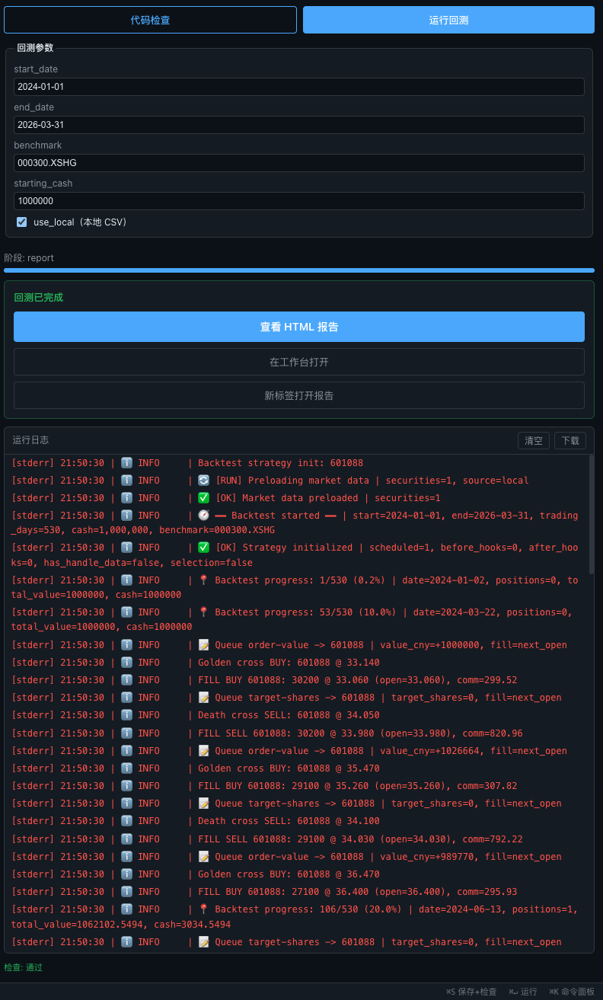
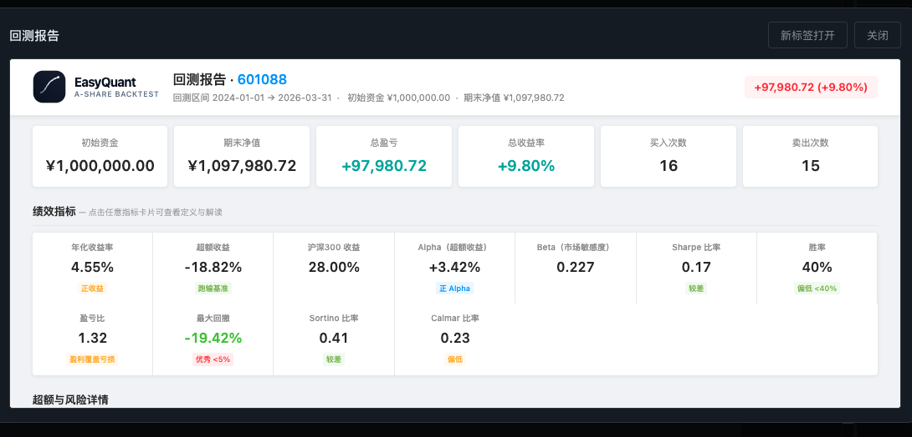
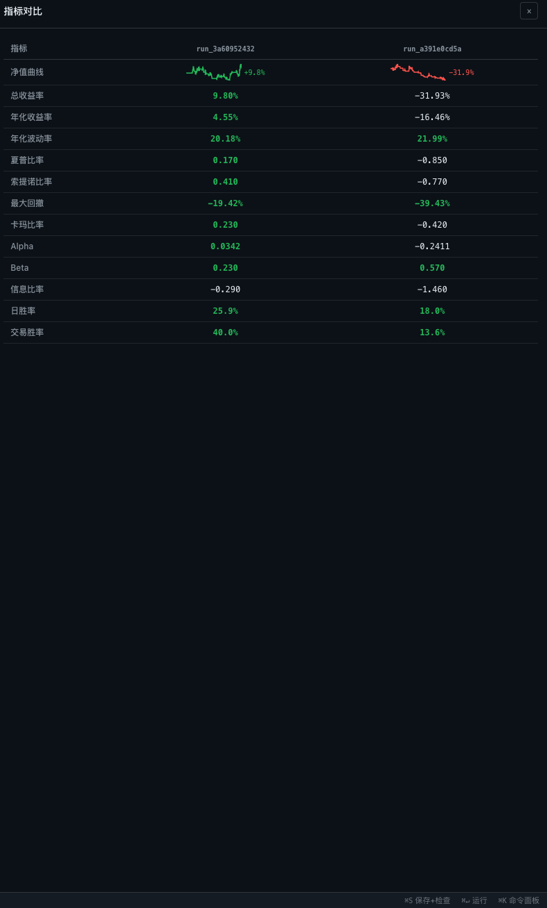

# Web 策略工作室

EasyQuant Web 策略工作室是一个基于浏览器的量化策略开发与回测平台。无需安装任何 Python 环境，打开浏览器即可编写策略、运行回测、查看报告和对比指标。

---

## 快速启动

```bash
cd /path/to/EasyQuant
npm run dev:all
```

然后在浏览器中打开 `http://localhost:5173/`。

---

## 环境搭建

### 前置要求

| 依赖 | 版本 | 说明 |
|------|------|------|
| Python | **3.9+**（推荐 3.11） | 与 eqlib 的 `requires-python` 一致 |
| Node | **18+**（推荐 20 LTS） | Vite 5 不兼容 Node 16 及以下 |
| pip 包 | `eqlib` | `pip install easyquant-eqlib`（PyPI）或在仓库根目录执行 `pip install -e .`（源码） |

若使用 nvm 管理 Node 版本，可在工作室目录执行 `nvm install && nvm use`（读取 `.nvmrc` 中的 `20`）。

### 一条命令启动（推荐）

```bash
cd /path/to/EasyQuant/web_strategy_studio
npm run install:all   # 首次运行：安装前后端依赖 + 构建符号表
npm run dev:all       # 启动后端 uvicorn(:8080) + 前端 Vite(:5173)
```

`dev:all` 由 `concurrently` 同时拉起两个进程，`Ctrl+C` 一次结束全部。

### 分步启动

如果只想单独启动某一端：

```bash
# 1. 安装后端
cd /path/to/EasyQuant
pip install -e .

cd web_strategy_studio/backend
pip install -e .

# 2. 启动 API（默认 127.0.0.1:8080）
python -m uvicorn studio_api.app:app --reload --host 127.0.0.1 --port 8080
```

```bash
# 3. 安装并启动前端
cd web_strategy_studio/frontend
npm install
npm run dev
```

然后在浏览器中打开 `http://localhost:5173/`。

### 环境变量

后端通过 `pydantic-settings` 读取环境变量（前缀 `EQ_STUDIO_`）：

| 变量 | 说明 | 默认值 |
|------|------|--------|
| `EQ_STUDIO_DATABASE_URL` | SQLAlchemy 异步 DSN | `sqlite+aiosqlite:///./studio.sqlite3` |
| `EQ_STUDIO_ARTIFACT_DIR` | 报告与产物目录 | `<仓库根>/artifacts` |
| `EQ_STUDIO_REPO_ROOT` | EasyQuant 仓库根路径 | 由 `config.py` 自动推断 |
| `EQ_STUDIO_RUN_TIMEOUT_SEC` | 单任务超时（秒） | `900` |
| `EQ_STUDIO_UVICORN_PORT` | 后端监听端口 | `8080` |
| `EQ_STUDIO_MAX_CONCURRENT_RUNS` | 同时运行回测上限 | `2` |

生产环境中若前后端不在同一域名，需在前端设置：

```bash
# frontend/.env.production
VITE_API_ORIGIN=https://your-api-host
```

### 常见问题

| 问题 | 解决方案 |
|------|----------|
| `Address already in use`（端口 8080） | `lsof -ti :8080 \| xargs kill`，或 `EQ_STUDIO_UVICORN_PORT=8081 npm run dev:all` |
| `crypto.getRandomValues is not a function` | Node 版本过低，升级到 18+ |
| 子进程引用了错误的 `studio_api` 包 | `pip uninstall eq-studio-api -y` 后在本目录重新 `pip install -e .` |
| macOS / Windows 兼容性 | macOS/Linux 直接用 `npm run dev:all`；Windows 用 WSL / Git Bash |

---

## 部署方式

### Docker Compose

在仓库根目录执行：

```bash
cd /path/to/EasyQuant
docker compose -f web_strategy_studio/docker-compose.yml build
docker compose -f web_strategy_studio/docker-compose.yml up -d
```

Compose 会同时构建两个服务：

| 服务 | 说明 |
|------|------|
| `api` | FastAPI + eqlib，监听 8080 内部端口 |
| `nginx` | 前端静态资源 + 反向代理 `/api` 和 `/static`，暴露 8080 |

数据通过 `studio-data` 持久化卷挂载，包含 SQLite 数据库和回测报告。

### 生产构建（前端静态托管）

如果你已有 Web 服务器，只需：

```bash
# 构建前端静态资源
cd web_strategy_studio/frontend
npm run build
# 产物在 frontend/dist/

# 后端单独部署（任意 WSGI/ASGI 宿主）
cd web_strategy_studio/backend
pip install -e .
uvicorn studio_api.app:app --host 0.0.0.0 --port 8080 --workers 1
```

Nginx 配置示例（前端静态资源 + `/api` 反向代理）：

```nginx
server {
    listen 80;
    server_name studio.example.com;

    # 前端 SPA
    location / {
        root /path/to/frontend/dist;
        try_files $uri $uri/ /index.html;
    }

    # API 反向代理
    location /api {
        proxy_pass http://127.0.0.1:8080;
        proxy_http_version 1.1;
        proxy_set_header Upgrade $http_upgrade;
        proxy_set_header Connection "upgrade";
    }

    # 静态报告
    location /static {
        proxy_pass http://127.0.0.1:8080;
    }
}
```

---

## 界面总览


Web 工作室采用三栏布局：

| 区域 | 功能 |
|------|------|
| **左侧编辑区** | Monaco 代码编辑器，内置 Python 语法高亮、自动补全和错误标记 |
| **右侧操作区** | 回测参数配置、运行按钮、实时日志和报告入口 |
| **顶部工具栏** | 代码检查、回测历史、指标对比、字体大小调节、命令面板 |

---

## 1. 编写策略

编辑器默认加载**均线交叉策略**模板，包含以下核心结构：

- `initialize(context)` — 策略初始化，设置股票池、均线参数、订单成本
- `market_open(context)` — 每个交易日的交易逻辑
- 使用 `attribute_history()` 获取历史 K 线数据
- 使用 `order_value()` / `order_target()` 下单

你可以直接修改股票代码、均线周期、止损比例等参数，编辑器会自动保存。

> **提示**：按 `Cmd+S`（Mac）或 `Ctrl+S`（Windows）执行代码检查，按 `Cmd+Enter` 运行回测。

---

## 2. 配置回测参数

在右侧面板配置回测参数：

| 参数 | 说明 | 默认值 |
|------|------|--------|
| `start_date` | 回测开始日期 | 2024-01-01 |
| `end_date` | 回测结束日期 | 2024-03-31 |
| `benchmark` | 基准指数代码 | 000300.XSHG（沪深300） |
| `starting_cash` | 初始资金 | 100,000 |
| `use_local` | 使用本地 CSV 数据（推荐勾选，速度更快） | ✓ |

---

## 3. 运行回测

点击右侧**"运行回测"**按钮：



回测过程中你可以看到：

- **进度条** — 显示当前进度和执行阶段（fetch_data → validate → simulate → report）
- **实时日志** — 每一笔买卖委托的成交记录
- **Toast 通知** — 回测完成后自动弹出提示
- **成功卡片** — 提供三种查看报告的方式：
  - **查看 HTML 报告** — 在浮层中预览
  - **在工作台打开** — 在独立路由页面查看
  - **新标签打开报告** — 在新浏览器标签页全屏查看

---

## 4. 查看回测报告

点击"查看 HTML 报告"打开报告浮层：



HTML 报告包含以下模块：

- **概览卡片** — 初始资金、期末净值、总盈亏、买入/卖出次数
- **绩效指标** — 年化收益率、Sharpe 比率、最大回撤、Alpha、Beta、胜率等 12 项核心指标
- **净值曲线图** — 策略净值与基准指数的走势对比（Lightweight Charts 交互式图表）
- **K 线图** — 交易标的的 OHLCV K 线，叠加均线和买卖标记
- **月度收益** — 每月收益率的柱状图
- **交易列表** — 每一笔交易的详细成交记录

---

## 5. 回测历史

点击工具栏的**"历史"**按钮：


历史记录面板展示所有回测记录：

- 每次回测显示运行 ID、策略名称、运行时间和状态
- **成功**的回测可点击"查看报告"和"对比"
- **运行中**的回测显示进度条和"重新附加"按钮（刷新页面后可恢复 SSE 连接）
- 最多可同时勾选 5 个回测进行对比

---

## 6. 指标对比

在回测历史中勾选 2 个以上回测，点击"对比"按钮：



对比表格展示以下维度：

| 维度 | 说明 |
|------|------|
| 净值曲线 | 迷你走势图（SVG sparkline），绿色上涨、红色下跌 |
| 总收益率 | 区间总收益百分比 |
| 年化收益率 | 年化复合收益率 |
| 年化波动率 | 日收益率年化标准差 |
| 夏普比率 | 风险调整后收益（越高越好） |
| 索提诺比率 | 下行风险调整后收益 |
| 最大回撤 | 最大峰值到谷值的跌幅 |
| 卡玛比率 | 年化收益 / 最大回撤 |
| Alpha / Beta | 相对于基准的超额收益和市场敏感度 |
| 信息比率 | 主动收益 / 跟踪误差 |
| 日胜率 / 交易胜率 | 盈利天数占比和盈利交易占比 |

数值自动着色：**绿色**表示正向指标（收益、Sharpe 等 > 0），**红色**表示负向指标。

---

## 7. 代码检查

点击工具栏的**"代码检查"**按钮（或 `Cmd+S`）执行静态分析：

- Python 语法错误 — 编辑器中用红色波浪线标记
- Lint 问题 — 用黄色波浪线标记（如未使用的变量、不规范命名）
- 安全检查 — 标记潜在的安全风险（如硬编码 API 密钥、不安全的系统调用）

---

## 8. 命令面板

按 `Cmd+K`（Mac）或 `Ctrl+K`（Windows）打开命令面板：

- 快速运行回测
- 快速格式化代码
- 清空运行日志
- 快速跳转到历史/对比视图

---

## 常见问题

### 回测一直显示 positions=0，没有交易

检查策略代码中是否设置了 `context.universe = [...]`。Web 工作室的数据预加载依赖这个配置来确定需要加载哪些股票的历史数据。

### 回测报告打不开

确保 `use_local` 已勾选，且本地数据目录（`data/`）中有对应股票和时间范围的 CSV 文件。

### 回测速度慢

勾选 `use_local` 使用本地 CSV 数据，比实时从网络获取快 10 倍以上。第一次运行会下载数据到本地缓存。
