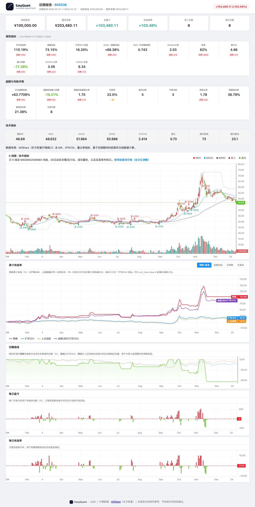
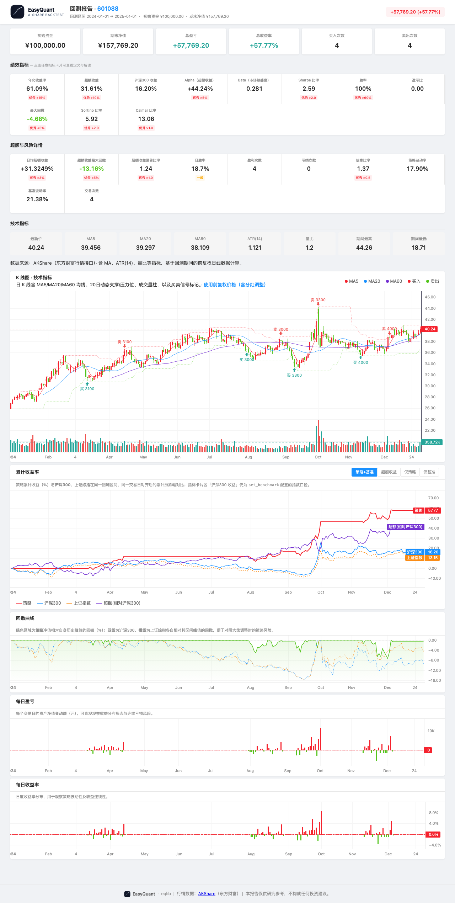
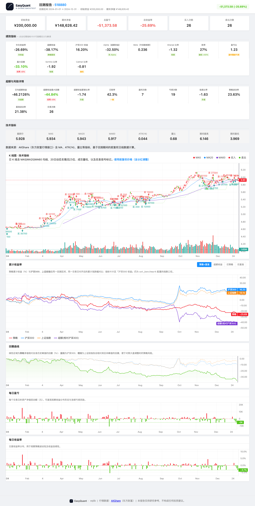

# 解读回测报告

!!! abstract "本篇导览"

    | 项目 | 说明 |
    |------|------|
    | **目标** | 理解 PNG、HTML、Markdown、JSON 四种报告 |
    | **前置** | [运行回测](run-backtest.md) |

---
## 1. 回测报告与图表解读

### 1.1 图表（PNG）

图表文件：`reports/backtest_YYYYMMDD_HHMMSS.png`

- **灰色线 (Close)**：股票每日收盘价
- **蓝色线 (MA5)**：5 日均线（短期趋势）
- **橙色线 (MA20)**：20 日均线（中期趋势）
- **绿色圆圈 (BUY)**：买入点
- **红色圆圈 (SELL)**：卖出点
- **绿色阴影区域**：持仓期间
- **绿色线 (右侧轴)**：投资组合总资产价值

### 1.2 交互式 HTML 报告

文件：`reports/backtest_YYYYMMDD_HHMMSS.html`，用浏览器打开。

页面自上而下分为：

1. **页头摘要** — 回测标的、时间区间、初始/最终资金，一眼判断盈亏
2. **核心指标卡片** — 年化收益、超额收益、夏普比率、最大回撤、胜率、卡玛比率
3. **详细指标行** — 年化波动率、索提诺比率、Alpha、Beta、信息比率、日胜率、盈亏比
4. **K 线与技术指标图** — 价格线 + 均线 + 买卖点标记 + 成交量
5. **累计收益率** — 叠加沪深300与上证综指两条宽基累计收益曲线
6. **回撤曲线** — 策略回撤 vs 两指数回撤
7. **每日盈亏** — 每个交易日的盈亏柱状图
8. **标签页** — 成交明细、持仓状态

**完整阅读流程：** 页头（赚钱了吗）→ 指标卡片（夏普/回撤合格吗）→ 累计收益图（相对大盘位置）→ 回撤曲线 → 成交表。

### 1.3 Markdown 报告

文件：`reports/backtest_YYYYMMDD_HHMMSS.md`，包含摘要、交易记录、持仓信息。

### 1.4 JSON 报告

文件：`reports/backtest_YYYYMMDD_HHMMSS.json`，机器可读的结构化数据。

```python
import json
with open('reports/backtest_20240101_120000.json') as f:
    report = json.load(f)
print("总收益: %.2f%%" % report['pnl_pct'])
```

---

## 2. 风险与归因分析

### 2.1 `analyze_returns`：综合风险指标

```python
from eqlib import analyze_returns
metrics = analyze_returns(result, risk_free_rate=0.03)
```

| 指标 | 说明 | 好值 |
|------|------|------|
| `total_return` | 总收益率 | 正数越大越好 |
| `annual_return` | 年化收益率 | 正数越大越好 |
| `annual_volatility` | 年化波动率 | 低一些更好 |
| `sharpe_ratio` | 夏普比率 | > 1 为好，> 2 为优秀 |
| `sortino_ratio` | 索提诺比率 | 只考虑下行风险，> 1 为好 |
| `max_drawdown` | 最大回撤 | 接近 0 越好 |
| `calmar_ratio` | 卡玛比率 | > 1 为好 |
| `alpha` | 超额收益（年化） | 正数为跑赢基准 |
| `beta` | 市场敏感度 | 1 表示与大盘同步 |
| `information_ratio` | 信息比率 | > 0.5 为好 |
| `win_rate_daily` | 日胜率 | > 0.5 为好 |
| `win_rate_trade` | 配对交易胜率 | 与日胜率含义不同 |

### 2.2 `brinson_attribution`：归因分析

```python
from eqlib import brinson_attribution
attr = brinson_attribution(result)
print("配置效应: %.4f" % attr['allocation_effect'])
print("选股效应: %.4f" % attr['selection_effect'])
```

### 2.3 `simple_factor_analysis`：因子分析

```python
from eqlib import simple_factor_analysis
ff = simple_factor_analysis(result)
print("市场 Beta: %.3f" % ff['market_beta'])
```

> **注意：** 本函数**不实现**真正的 Fama-French 三因子模型。`momentum_correlation` 字段为收益自相关，非真正的动量因子暴露。`fama_french_analysis` 已弃用，请改用 `simple_factor_analysis`。

详细指标字段定义见 [报告格式规范](../reference/reports-format.md)。

---

## 3. 运行后你会得到什么

在代码中调用：

```python
from eqlib import run_strategy

result = run_strategy(
    initialize,
    start_date="2024-01-01",
    end_date="2024-12-31",
    starting_cash=100_000,
    benchmark="000300.XSHG",
    securities=["601390"],
    report_dir="reports",
)
```

终端会打印类似路径（时间戳每次不同）：

| 文件 | 用途 |
|------|------|
| `reports/backtest_YYYYMMDD_HHMMSS.png` | 静态图：价格、均线、买卖点、组合净值/回撤等（与策略实现有关） |
| `reports/backtest_YYYYMMDD_HHMMSS.html` | **交互式报告**：指标卡片、K 线、累计收益、回撤、每日盈亏、成交与持仓等 |
| `reports/backtest_YYYYMMDD_HHMMSS.md` | 人类可读的摘要 + 表格化交易记录 |
| `reports/backtest_YYYYMMDD_HHMMSS.json` | 程序化分析用结构化数据 |

用浏览器 **直接打开 `.html` 文件**（双击或「文件 → 打开」），无需启动 Web 服务器。

### 3.1 HTML 报告页面概览

打开 `.html` 文件后，你看到的页面大致分为以下区块（以下为 Example 22 选股策略的回测截图）：


页头（标题 + 盈亏金额）→ 核心指标卡片 → 详细指标行 → K 线图 → 累计收益率 → 回撤 → 每日盈亏 → 成交/持仓标签页。

---

## 4. HTML 报告页面结构（从上到下）

以下为 `generate_html_report` 生成页面的逻辑顺序，便于你对照屏幕阅读。

### 4.1 页头

- **标题**：回测标的或组合说明。
- **摘要区**：回测区间、初始资金、最终资产、盈亏金额与比例等。

### 4.2 指标卡片（可点击看说明）

常见字段与**读法**：

| 展示名 / 字段 | 含义（直觉版） |
|----------------|----------------|
| **年化收益** | 把整段回测收益换算成「若按同样波动持续一年」的复利年化水平；便于跨周期对比 |
| **超额收益** | 策略总收益相对基准总收益的多出部分 |
| **基准收益** | 同一区间内基准指数涨跌幅 |
| **Alpha** | 相对基准回归后的年化超额收益（CAPM 意义下「跑赢/跑输」的一部分） |
| **Beta** | 相对大盘的弹性；1 附近表示与指数同涨同跌，大于 1 波动更大 |
| **夏普比率** | 每承担一单位总波动，获得多少超过无风险利率的收益；一般 **> 1** 认为尚可 |
| **胜率（交易）** | 完整「买—卖」配对中，盈利回合占比 → 对应 `win_rate_trade` |
| **盈亏比** | 平均盈利单 / 平均亏损单（绝对值比） |
| **最大回撤** | 从历史峰值到之后谷底的最大跌幅，**负数**，绝对值越小风控越好 |
| **索提诺比率** | 类似夏普，但分母只用**下行波动**；更关注「跌的时候有多痛」 |
| **卡玛比率** | 年化收益 / \|最大回撤\|；回撤小且收益高则数值大 |
| **日超额收益（年化）** | 日度超额收益均值的年化 |
| **超额最大回撤** | 超额收益序列上的最大回撤 |
| **超额夏普** | 日超额收益的夏普 |
| **日胜率** | 盈利交易日 / 总交易日 → `win_rate_daily` |
| **盈利笔数 / 亏损笔数** | 配对交易后的笔数 |
| **信息比率** | 主动收益相对跟踪误差的效率 |
| **年化波动率** | 策略日收益年化标准差 |
| **基准波动率** | 基准日收益年化波动 |
| **交易次数** | 完成的配对交易笔数 |

卡片上的「评级条」为根据阈值着色的快速提示，**仍以你自己策略目标为准**。

### 4.3 K 线与技术图区（若有）

标题一般为 **「K 线图 · 技术指标」**：主图显示 OHLCV K 线、成交量柱、MA 均线叠加，以及买卖信号标记。

#### 技术指标

| 指标 | 说明 |
|------|------|
| **MA 均线** | MA5（红色）、MA20（蓝色）、MA60（紫色）三条移动平均线叠加在 K 线主图上 |
| **RSI(14)** | 独立图表，含 70 超买线（红色虚线）、30 超卖线（绿色虚线）和中位 50 线（灰色虚线） |
| **MACD(12,26,9)** | 独立图表，含 MACD 线（蓝色）、Signal 线（橙色）、柱状图（红绿）和零轴参考线 |
| **Bollinger Bands(20,2)** | 可选叠加在 K 线图上：上轨、中轨、下轨 |

#### 指标切换面板

K 线图左上角有浮动按钮组，可独立开关以下指标：

| 按钮 | 默认状态 | 功能 |
|------|---------|------|
| **MA** | 开启 | 显示/隐藏 MA5/MA20/MA60 三条均线 |
| **BB** | 关闭 | 显示/隐藏 Bollinger Bands 上下轨 |
| **VOL** | 开启 | 显示/隐藏成交量柱 |
| **S/R** | 关闭 | 显示/隐藏支撑/阻力线 |

#### 十字光标联动图例

鼠标在 K 线图上移动时，左上角会实时显示当前光标位置的：

- OHLC 价格
- MA5/MA20/MA60 值
- RSI 值
- MACD / Signal / Histogram 值
- BB 上轨/中轨/下轨
- 成交量

### 4.4 累计收益率

- **策略**累计收益（%）曲线。
- **沪深300**、**上证综指**两条基准线：与策略使用**同一回测区间、同一交易日对齐**后的累计涨跌幅（%），便于判断相对大盘宽基是跑赢还是跑输（与 `set_benchmark` 配置无关，图表内固定双基准）。
- **超额(相对沪深300)**：在「超额收益」标签下显示，为策略累计收益减沪深300累计收益；指标卡片区「超额收益」仍以 `analyze_returns` 相对 **你所设基准** 为准。

### 4.5 回撤曲线

- **绿色区域**：策略净值相对**自身**历史峰值的回撤（%）。
- **蓝色虚线**：沪深300指数相对其区间峰值的回撤。
- **橙色虚线**：上证综指相对其区间峰值的回撤。  
  用于对照：大盘深度调整时，策略回撤是否更大、是否跟跌。

### 4.6 每日盈亏 / 每日收益率

柱状或曲线展示 **相邻交易日** 组合价值变化；用于看「是否连续亏损」「波动是否集中」。

### 4.7 标签页：成交、日历、持仓等

- **成交**：每笔买卖的时间、价格、数量、佣金。
- **持仓**：各期末或关键节点的持仓结构（以实际导出为准）。
- 其他 Tab 为辅助信息（如数据源说明等）。

### 4.8 对照走读示例

下面用一次真实导出（标的 **601398**，区间 **2021-06-06～2024-06-06**）说明：**打开 HTML 时，各块数字在说什么**。运行 `python examples/06_local_data.py` 后，在 `reports/` 下打开**最新** `*.html`，对照下表阅读（下列数值为该次运行的快照，与教程配图同源）。

> **说明：**本示例策略为 MA 5/20 金叉死叉策略，在该区间**小幅盈利**，夏普为正、回撤可控，适合用来理解「正常策略的报告长什么样」。

| HTML 上常见位置 | 本例约值（见 MD/JSON） | 读法 |
|----------------|----------------------|------|
| **页眉 / 总盈亏** | 约 **+16.11%** | 全区间总收益率（相对初始资金），与 `summary.pnl_pct`、`risk_metrics.total_return` 一致。 |
| **摘要行** | 初始 100,000 → 期末 **116,108** | 已扣交易成本后的组合净值终值。 |
| **年化收益** | **+5.15%** | 由日收益折算的年化水平；高于无风险利率（约 3%）但不算高。 |
| **年化波动率** | **12.83%** | 收益波动幅度；适中，曲线不会太「抖」。 |
| **夏普比率** | **+0.22** | 风险调整后收益；略高于 0，说明承担了一定风险后略有超额收益。 |
| **索提诺比率** | **+0.31** | 只看下行波动的风险调整指标；夏普为正时通常也为正。 |
| **最大回撤** | **-14.45%** | 从峰值到谷底的最大跌幅；本例回撤适中，风控压力不大。 |
| **卡玛比率** | **+0.36** | 年化收益 / \|最大回撤\|；收益正、回撤可控时为正。 |
| **日胜率** | **29.4%** | `win_rate_daily`：盈利交易日占比；本策略持仓周期长，日胜率不高但单次盈利可观。 |
| **胜率（交易）** | **65.3%** | `win_rate_trade`：完整买—卖配对中，盈利回合占比；超过半数交易盈利。 |
| **盈利笔数 / 亏损笔数** | 约 **125 / 66** | 配对层面的赢/输笔数；盈利笔数明显多于亏损。 |
| **盈亏比** | **0.97** | 平均盈利单 / 平均亏损单；接近 1，说明盈利单笔和亏损单笔金额相近。 |
| **交易次数（配对）** | **约 95** | 完成「一轮买+卖」的组数；与 JSON `summary.num_trades`（单边成交条数，本例 191）不同，见 [FAQ](../project/faq.md#faq-json-num-trades)。 |
| **年化换手率** | 较低 | 本策略为低频择时策略，换手率不高。 |
| **总佣金** | **0.00** | 本例使用本地数据回测，佣金展示为 0；实际交易中需考虑。 |
| **Alpha / Beta / 信息比率** | 取决于基准对齐情况 | 当基准序列未对齐时可能为占位；`summary.benchmark_return` 为 `null` 时见 [FAQ](../project/faq.md#faq-benchmark-null)。 |

**交互区（K 线、累计收益、回撤、每日盈亏）**：用鼠标在图上拖动、缩放；策略线 vs 基准线对比「是否跑赢指数」。若**整页图表空白**，多为 **CDN 脚本被内网拦截**，需联网或换网络（见 [FAQ — HTML 图表空白](../project/faq.md#faq-html-blank)）。

**自己截 HTML 长图（可选）**：浏览器全屏后使用系统截图（如 macOS `Cmd + Shift + 4`、Windows `Win + Shift + S`），截取页眉 + 指标卡片区，便于写笔记或与同事对齐结论。

---

## 5. PNG 图（`generate_chart`）怎么读

典型元素包括：

- **价格与均线**：判断趋势与信号是否出现在合理位置。
- **买卖点标记**：与策略逻辑对照，是否存在「追高杀跌」。
- **组合总价值或收益**：右侧或副图，看资金曲线是否平滑上升。
- **回撤带**：下方区域展示回撤深度。

若图中缺少净值曲线，请对照 [FAQ — PNG 很空](../project/faq.md) 检查 `record` / 记录数据是否完整。

---

## 6. 不同策略报告对比：如何通过报告判断策略好坏

以下是 4 个不同策略在 2024 年的回测截图，报告结构相同，数值各异。

### 盈利策略：MACD 趋势 + 成交量确认（+103.48%）



- **夏普比率**：高 → 风险调整后收益好
- **交易次数**：16 笔 → 不算太频繁
- **累计收益曲线**：总体向上
- **关键判断**：盈利主要来几次大行情，不是靠频繁交易堆积

### 震荡市表现好：布林带均值回归（+57.77%）



- **交易次数**：8 笔 → 低频策略
- **回撤**：控制得当
- **关键判断**：适合震荡市，趋势行情可能表现一般

### 组合策略：多因子选股（+5.19%）


- **交易次数**：135 笔 → 高频换手
- **换手率高**：佣金成本需关注
- **关键判断**：收益被高频交易成本侵蚀

### 亏损策略：动量组合（-25.69%）



- **夏普比率**：负值
- **最大回撤**：-33.10%
- **日胜率**：42.3% → 输多赢少
- **关键判断**：动量策略在震荡市中反复"追涨杀跌"

### 如何从报告判断策略好坏

| 检查项 | 好策略 | 差策略 | 说明 |
|--------|--------|--------|------|
| **年化收益** | 正数，> 10% | 负数或 < 5% | 基础要求 |
| **夏普比率** | > 1 | < 0 | 风险调整后收益 |
| **最大回撤** | < 15% | > 30% | 最大亏损承受 |
| **交易胜率** | > 50% | < 30% | 配对交易胜率 |
| **盈亏比** | > 1.5 | < 1 | 平均盈利/平均亏损 |
| **交易频率** | 适中 | 过多或过少 | 过多成本高 |
| **Alpha** | 正数 | 零或负 | 超额收益来源 |

---

## 7. 进阶：只生成某一种报告

```python
from eqlib import run_backtest, generate_html_report, analyze_returns

result = run_backtest(initialize, "2024-01-01", "2024-12-31", securities=["601390"])
if result:
    generate_html_report(result, "reports/my_report.html")
    print(analyze_returns(result))
```

详见 [API 参考 — 报告与分析 API](../reference/api-analysis.md)。
