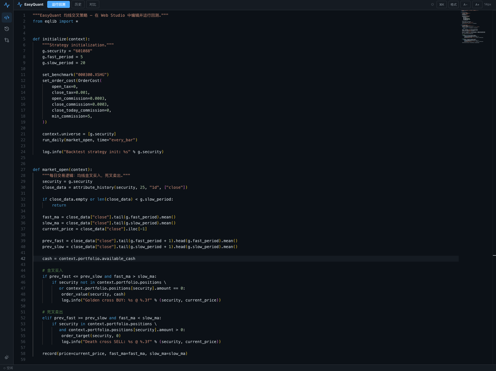
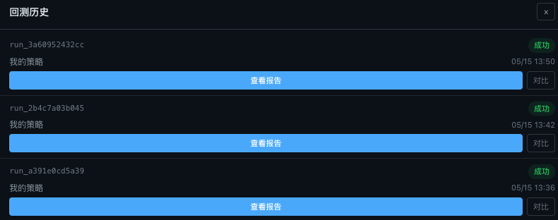

# Web 策略工作室

EasyQuant Web 策略工作室是一个基于浏览器的量化策略开发与回测平台。无需安装任何 Python 环境，打开浏览器即可编写策略、运行回测、查看报告和对比指标。

!!! tip "部署指南"

    如果你需要搭建 Web 工作室，请参阅 [部署指南](deploy-web-studio.md)。

---

## 登录与认证

Web 工作室启用 JWT 认证保护所有 API 端点。用户需通过预设账号登录，**不支持自主注册**。

### 登录机制

- 登录页面仅支持登录功能，用户账号需由服务端预先配置（详见下方「预设用户账户」）
- Token 存储在浏览器 `localStorage` 中，有效期 24 小时
- **自动登出**：当 Token 失效（过期、无效或被服务器拒绝返回 401）时，前端自动清除本地认证状态并返回登录页面，无需手动操作

### 默认管理员账户

| 用户名 | 密码 |
|--------|------|
| `admin` | `admin123` |

首次启动后端时会自动创建管理员账户。**生产环境中务必通过环境变量修改默认密码**：

```bash
export EQ_ADMIN_PASSWORD="your-secure-password"
```

### 预设用户账户

可以通过配置文件或环境变量预设多个用户账户，方便团队协作或演示环境。

#### 配置文件方式（推荐）

在 `web_strategy_studio/backend/users.yaml` 中配置：

```yaml
preset_users:
  - username: demo
    password: demo123
  - username: analyst
    password: analyst456
  - username: quant
    password: quant789
```

后端启动时会自动读取并创建这些用户。修改配置后需重启后端生效。

#### 环境变量方式

```bash
# 格式：逗号分隔的 username:password 列表
export EQ_PRESET_USERS="demo:demo123,analyst:analyst456"
```

#### 同时使用两种方式

如果同时配置了 `users.yaml` 和 `EQ_PRESET_USERS`，两者的用户都会被创建（用户名重复时跳过）。

### JWT 密钥配置

默认情况下 JWT 密钥每次重启随机生成（开发环境友好）。生产部署中需固定密钥，否则重启后所有登录态失效：

```bash
export EQ_JWT_SECRET="your-random-secret-key"
```

### Token 机制

- 登录成功后，Token 存储在浏览器 `localStorage` 中
- 所有 API 请求通过 `Authorization: Bearer <token>` 头认证
- SSE 实时日志流因 EventSource 不支持自定义 Header，使用 `?token=` 查询参数传递
- Token 默认有效期 24 小时（可通过 `EQ_JWT_EXPIRE_MINUTES` 调整）

### 权限隔离

- 每个用户只能查看和操作自己创建的策略和回测
- 回测日志 SSE 流、报告数据等端点均做所有权验证
- 子进程环境过滤敏感变量（`EQ_JWT_SECRET`、`EQ_ADMIN_PASSWORD` 等不会泄露到策略代码中）

---

## 界面总览



Web 工作室采用三栏布局：

| 区域 | 功能 |
|------|------|
| **左侧边栏** | 图标导航栏，包含策略编辑器、回测历史、数据管理、指标对比四个入口，底部有主题切换和退出登录按钮 |
| **中间编辑区** | Monaco 代码编辑器，内置 Python 语法高亮、自动补全和错误标记 |
| **右侧操作区** | 回测参数配置、运行按钮、实时日志和报告入口 |
| **顶部工具栏** | 代码检查、回测历史、指标对比、字体大小调节、命令面板 |

---

## 1. 编写策略

编辑器默认加载**均线交叉策略**模板，包含以下核心结构：

- `initialize(context)` — 策略初始化，设置股票池、均线参数、订单成本
- `market_open(context)` — 每个交易日的交易逻辑
- 使用 `attribute_history()` 获取历史 K 线数据
- 使用 `order_value()` / `order_target()` 下单

你可以直接修改股票代码、均线周期、止损比例等参数，编辑器会自动保存。

> **提示**：按 `Cmd+S`（Mac）或 `Ctrl+S`（Windows）执行代码检查，按 `Cmd+Enter` 运行回测。

---

## 2. 配置回测参数

在右侧面板配置回测参数：

| 参数 | 说明 | 默认值 |
|------|------|--------|
| `start_date` | 回测开始日期 | 2024-01-01 |
| `end_date` | 回测结束日期 | 2024-03-31 |
| `benchmark` | 基准指数代码 | 000300.XSHG（沪深300） |
| `starting_cash` | 初始资金 | 100,000 |
| `use_local` | 使用本地 CSV 数据（推荐勾选，速度更快） | ✓ |

---

## 3. 运行回测

点击右侧**"运行回测"**按钮：


回测过程中你可以看到：

- **进度条** — 显示当前进度和执行阶段（fetch_data → validate → simulate → report）
- **实时日志** — 每一笔买卖委托的成交记录
- **Toast 通知** — 回测完成后自动弹出提示
- **成功卡片** — 提供两种查看报告的方式：
  - **查看 HTML 报告** — 在浮层中预览
  - **新标签打开报告** — 在新浏览器标签页全屏查看

---

## 4. 查看回测报告

点击"查看 HTML 报告"打开报告浮层：


HTML 报告包含以下模块：

- **概览卡片** — 初始资金、期末净值、总盈亏、总收益率、交易次数
- **绩效指标** — 年化收益率、Sharpe 比率、最大回撤、Alpha、Beta、胜率等 12 项核心指标
- **K 线图** — OHLCV K 线，叠加 MA5/MA20/MA60 均线、成交量柱、买卖信号标记
- **技术指标** — RSI(14)、MACD(12,26,9)、Bollinger Bands(20,2)，独立图表展示
- **指标切换** — K 线图左上角按钮组，可独立开关 MA/BB/VOL/支撑阻力
- **十字光标联动** — 鼠标移动时实时显示当前光标位置的 OHLC、均线、指标值
- **累计收益率** — 策略净值 vs 沪深300 vs 上证指数
- **回撤曲线** — 策略相对自身峰值的回撤
- **每日盈亏/收益率** — 柱状图展示
- **时间轴同步** — 所有图表支持联动缩放和拖动

> **原生渲染**：Web 控制台中的报告浮层使用 **原生 Lightweight Charts** 直接渲染（取代了旧版 iframe 方案），具备完整的十字光标同步、响应式缩放和指标切换交互。

---

## 5. 回测历史

点击左侧边栏的**历史**图标或右侧面板的**历史**按钮：



历史记录面板展示所有回测记录：

- 每次回测显示运行 ID、策略名称、运行时间和状态
- **成功**的回测可点击"查看报告"和"对比"
- **运行中**的回测显示进度条和"重新附加"按钮（刷新页面后可恢复 SSE 连接）
- 最多可同时勾选 5 个回测进行对比
- **智能轮询**：当有运行中的回测时每 5 秒自动刷新，全部完成后停止轮询以节省资源

---

## 6. 指标对比

在回测历史中勾选 2 个以上回测，点击"对比"按钮：


对比表格展示以下维度：

| 维度 | 说明 |
|------|------|
| 净值曲线 | **Lightweight Charts 迷你面积图**（60×24px），绿色表示区间上涨、红色表示下跌 |
| 总收益率 | 区间总收益百分比 |
| 年化收益率 | 年化复合收益率 |
| 年化波动率 | 日收益率年化标准差 |
| 夏普比率 | 风险调整后收益（越高越好） |
| 索提诺比率 | 下行风险调整后收益 |
| 最大回撤 | 最大峰值到谷值的跌幅 |
| 卡玛比率 | 年化收益 / 最大回撤 |
| Alpha / Beta | 相对于基准的超额收益和市场敏感度 |
| 信息比率 | 主动收益 / 跟踪误差 |
| 日胜率 / 交易胜率 | 盈利天数占比和盈利交易占比 |

数值自动着色：**绿色**表示正向指标（收益、Sharpe 等 > 0），**红色**表示负向指标。

---

## 7. 代码检查

点击工具栏的**"代码检查"**按钮（或 `Cmd+S`）执行静态分析：

- Python 语法错误 — 编辑器中用红色波浪线标记
- Lint 问题 — 用黄色波浪线标记（如未使用的变量、不规范命名）
- 安全检查 — 标记潜在的安全风险（如硬编码 API 密钥、不安全的系统调用）

---

## 8. 命令面板

按 `Cmd+K`（Mac）或 `Ctrl+K`（Windows）打开命令面板：

- 快速运行回测
- 快速格式化代码
- 清空运行日志
- 快速跳转到历史/对比视图

---

## 9. 用户体验特性

### 加载状态指示

- 登录按钮在提交时显示加载动画
- 股票搜索时显示加载状态
- 回测运行时显示进度条和阶段信息

### 无障碍访问

- 通知消息使用 `aria-live="polite"` 属性，屏幕阅读器可播报
- 导航按钮有明确的 `aria-label` 描述
- 表单输入框支持自动聚焦（`autoFocus`）

### 性能优化

- 回测历史列表智能轮询：仅在有活跃任务时刷新
- 股票搜索请求可取消：新搜索自动终止前一个请求
- SSE 实时日志在组件卸载时正确清理资源

---

## 常见问题

### 回测一直显示 positions=0，没有交易

检查策略代码中是否设置了 `context.universe = [...]`。Web 工作室的数据预加载依赖这个配置来确定需要加载哪些股票的历史数据。

### 回测报告打不开

确保 `use_local` 已勾选，且本地数据目录（`data/`）中有对应股票和时间范围的 CSV 文件。

### 回测速度慢

勾选 `use_local` 使用本地 CSV 数据，比实时从网络获取快 10 倍以上。第一次运行会下载数据到本地缓存。

### 登录后频繁自动退出

检查后端是否正常运行，JWT 密钥是否稳定配置（生产环境需设置 `EQ_JWT_SECRET` 环境变量，否则重启后密钥变化导致所有 Token 失效）。若后端重启，需重新登录。

### 主题切换不生效

点击左侧边栏底部的太阳/月亮图标可切换深色、浅色、跟随系统三种模式。切换后立即生效。
