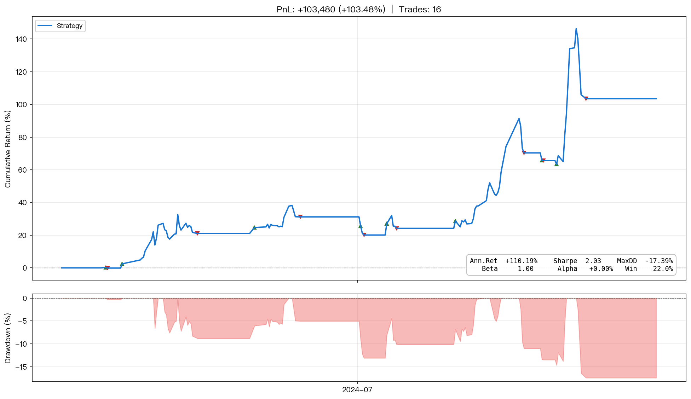
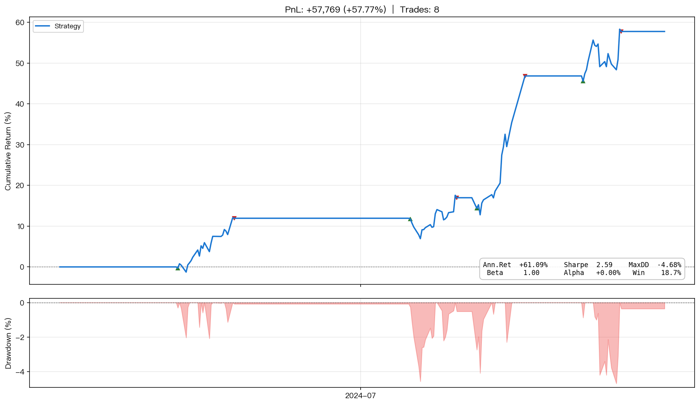
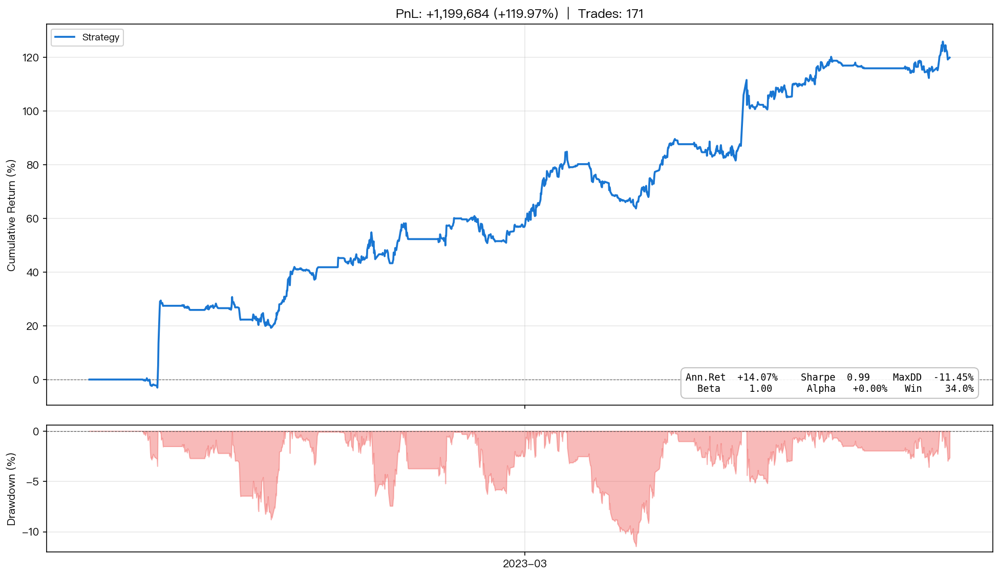

---
hide:
  - navigation.path
---

<div align="center">
<a href="https://github.com/AlanFokCo/EasyQuant"></a>
</div>

# EasyQuant

面向中国 A 股的事件驱动量化回测框架。

```bash
pip install easyquant-eqlib
```

<div class="hero-cards">
<a class="hero-card" href="tutorials/00-getting-started/">
<span class="hero-card-icon">🚀</span>
<h3>快速入门</h3>
<p>从安装到运行第一个回测，15 分钟即可上手。</p>
<span class="card-link">开始 →</span>
</a>
<a class="hero-card" href="how-to/">
<span class="hero-card-icon">📖</span>
<h3>操作指南</h3>
<p>按场景定位：编写策略、运行回测、解读报告。</p>
<span class="card-link">查看 →</span>
</a>
<a class="hero-card" href="tutorials/">
<span class="hero-card-icon">🎓</span>
<h3>分步教程</h3>
<p>从零到实盘的 11 篇系列教程，含真实策略案例。</p>
<span class="card-link">学习 →</span>
</a>
<a class="hero-card" href="reference/">
<span class="hero-card-icon">🔧</span>
<h3>API 参考</h3>
<p><code>eqlib</code> 全部公开 API 的参数、返回值与示例。</p>
<span class="card-link">查阅 →</span>
</a>
<a class="hero-card" href="how-to/web-studio/">
<span class="hero-card-icon">🌐</span>
<h3>Web 工作室</h3>
<p>浏览器中编写策略、运行回测、查看报告。</p>
<span class="card-link">体验 →</span>
</a>
</div>

## 核心能力

- **事件驱动回测** — `initialize` → `run_daily` → `handle_data`，与 JoinQuant / Zipline 一致
- **A 股全量数据** — 日线/分钟线/Tick、财务摘要、资金流向、北向资金、涨跌停统计
- **风险分析** — Sharpe / Sortino / Max Drawdown / Alpha & Beta / Brinson 归因
- **组合风控** — VaR、策略相关性、集中度风险、Kill Switch 熔断
- **模拟盘 + PTrade/QMT 适配** — 实盘前验证 + 一键导出券商平台

## 最小示例

```python
from eqlib import *

def initialize(context):
    g.security = '601390'
    set_benchmark('000300.XSHG')
    run_daily(market_open, time='every_bar')

def market_open(context):
    hist = attribute_history(g.security, 20, '1d', ['close'])
    ma20 = hist['close'].mean()
    price = hist['close'].iloc[-1]

    if price > ma20 * 1.02:
        order_value(g.security, context.portfolio.available_cash)
    elif price < ma20 * 0.98 and context.portfolio.positions.get(g.security):
        order_target(g.security, 0)

result = run_strategy(
    initialize,
    start_date='2024-01-01',
    end_date='2024-12-31',
    starting_cash=100000,
    securities=['601390'],
)
```

> **订单执行模型：** `order*` API 在当前回调中只是下单，实际按**下一交易日开盘价**成交，避免前视偏差。详见 [回测执行模型](explanation/backtest-model.md)。

## 报告预览

| MACD 趋势 + 成交量 | 布林带均值回归 | 支撑/阻力位 |
|:---:|:---:|:---:|
| **+103.48%** | **+57.77%** | **+119.97%** |
| [](assets/tutorials/example_report_macd_volume.png) | [](assets/tutorials/example_report_bollinger.png) | [](assets/tutorials/example_report_sr_strategy.png) |

---

!!! info

    本文档仅供学习研究，不构成投资建议。
