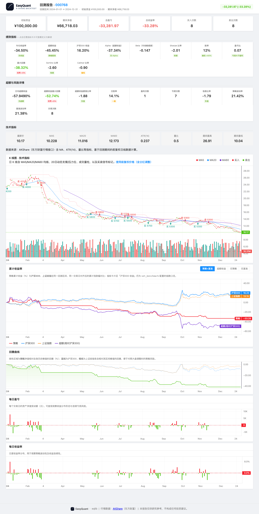

# Tutorial 02: 回测验证

!!! abstract "本篇导览"

    | 项目 | 说明 |
    |------|------|
    | **目标** | 读懂回测输出与风险指标，识别过拟合、未来函数与数据问题 |
    | **预计用时** | 60～90 分钟 |
    | **前置** | [Tutorial 00](00-getting-started.md)、[Tutorial 01](01-first-strategy.md)；详表见 [报告格式详解](../reference/reports-format.md) |

> 深入理解回测结果，解读报告和图表，判断策略是否真的有效。

**延伸阅读：** [FAQ](../project/faq.md)（HTML 空白、JSON 字段等排错）。

---

## 目录

1. [回测是什么](#1-回测是什么)
2. [回测能告诉你什么](#2-回测能告诉你什么)
   - [2.1 仓库内报告示例（reports/）](#21-仓库内报告示例reports)
   - [2.2 不同策略的回测报告对比](#22-不同策略的回测报告长什么样)
3. [解读回测报告](#3-解读回测报告)
4. [解读图表](#4-解读图表)
5. [风险与归因分析](#5-风险与归因分析)
6. [判断策略是否有效](#6-判断策略是否有效)
7. [常见回测陷阱](#7-常见回测陷阱)
8. [组合回测](#8-组合回测)
9. [下一步](#9-下一步)

---

## 1. 回测是什么

**回测（Backtesting）** 是把你的交易策略用历史数据"回放"一遍，看看如果当时真的按照这个策略交易，结果会怎样。

```
你的策略规则
     +
历史行情数据
     ↓
回测引擎 → 模拟交易 → 交易记录 + 组合价值曲线
```

### 回测的作用

- **验证想法**：你觉得有效的策略，真的能赚钱吗？
- **发现缺陷**：策略有没有你没想到的边界情况？
- **参数选择**：哪个参数组合更合理？
- **建立信心**：在投入真金白银之前，有一个量化的评估

### 回测不能告诉你什么

- **未来一定能赚钱**：历史表现不等于未来收益
- **精确的盈利金额**：回测有各种偏差（滑点、流动性等）
- **策略在所有市场环境都有效**：牛市有效的策略在熊市可能失效

---

## 2. 回测能告诉你什么

运行回测后，你会得到一组核心指标：

| 指标 | 含义 | 参考标准 |
|------|------|---------|
| **总收益率** | 回测期间的总盈利/亏损百分比 | 跑赢基准（沪深300）为好 |
| **年化收益率** | 折算为每年的收益率 | > 10% 为合格，> 20% 为优秀 |
| **年化波动率** | 收益的波动幅度 | 低一些更好（< 25% 为佳） |
| **夏普比率** | 每承受一单位风险，获得多少超额收益 | > 1 为好，> 2 为优秀 |
| **最大回撤** | 从最高点到最低点的最大亏损幅度 | 越小越好（< 15% 为佳） |
| **索提诺比率** | 类似夏普，但只考虑下行波动 | > 1 为好 |
| **Alpha** | 跑赢基准的超额收益 | 正数为好 |
| **Beta** | 相对大盘的敏感度 | 接近 1 = 跟随大盘 |
| **胜率** | 在 HTML 中可能对应「日胜率」或「交易胜率」，含义不同 | 见下文与 [报告格式详解](../reference/reports-format.md) |

> **说明：**`analyze_returns` 返回的 **`win_rate_daily`** 为按交易日统计的胜率；**`win_rate_trade`** 为完整买卖配对后的胜率。二者不可直接比较数值高低来判断策略好坏。

---

## 2.1 仓库内报告示例（`reports/`）

真实回测会在仓库根目录的 **`reports/`** 下写出四套文件（`.html` / `.png` / `.md` / `.json`）。文件名带时间戳；带后缀的（如 `_19_localdata`）通常对应示例脚本里的 `report_suffix` 或脚本说明。

**推荐阅读：** 仓库内 [`reports/README.md`](../how-to/read-reports.md) 列出了与示例脚本对应的对照表。下面 HTML 截图与其中 **`backtest_20260511_234245_19_localdata.html`** 为同一次运行（示例 [`19_local_data_backtest.py`](https://github.com/AlanFokCo/EasyQuant/blob/main/examples/19_local_data_backtest.py)）；副本放在 `assets/tutorials/` 便于在网页里直接显示，**你本地学习时请同时用浏览器打开同名的 `.html`** 对照 [报告格式详解](../reference/reports-format.md)。



**同一组结果还可打开：**

- `../reports/backtest_20260511_234245_19_localdata.html`（仓库根下 `reports/`，交互式报告；**累计收益与回撤图**中含沪深300与上证综指双线基准）
- 若你尚未生成：在仓库根执行 `python examples/19_local_data_backtest.py`，再在 `reports/` 中找到最新生成的 `*_19_localdata.*`。

抽象「策略 vs 基准」折线示意见仍保留：`../assets/tutorials/sample_equity_vs_benchmark.svg`。

**对照 HTML 页眉与指标卡片读数：**打开上节同名 `.html` 后，按 [报告格式详解](../reference/reports-format.md) **第 2.8 节**逐条对照（与上 HTML 截图同源示例）；若图区空白，多为 CDN 被拦，见 [FAQ](../project/faq.md)。

---

## 2.2 不同策略的回测报告长什么样？

同一个框架，不同策略的报告 **结构相同、数值不同**。下面用 6 个已跑通的示例展示：打开各脚本对应的 `.html`，可以看到相同的页面结构、截然不同的指标卡片数值。

### 布林带均值回归（Example 14，股票 601088 中国神华）


> 结果：**+57.77%**，交易 8 笔。布林带策略在震荡市表现优异——价格触及下轨买入、上轨卖出，天然的低买高卖逻辑。

### MACD 趋势 + 成交量确认（Example 15，股票 600536 中国软件）


> 结果：**+103.48%**，交易 16 笔。科技股波动大，MACD 金叉配合放量确认，能较好地捕捉趋势启动点。

### 网格交易（Example 17，股票 601857 中国石油）


> 结果：**+30.25%**，交易 10 笔。网格适合低波动、有明确价格区间的股票——在区间内反复"低吸高抛"。

### 多因子选股（Example 16，10 只股票池）


> 结果：**+5.19%**，交易 135 笔。多因子模型每周从 10 只股票中选出动量/成交量/波动率综合得分最高的 3 只，高频换手。

### 选股策略界面（Example 22，14 只股票池）


> 结果：**+16.96%**，持有 5 只股票。基于 PE 低估值选股 + 月度调频，买入后持有至期末。Brinson 归因显示配置效应 +2.84%、选股效应 +2.84%。

### 组合回测（Example 12，5 只股票等权）


> 结果：**-25.69%**，交易 52 笔。动量策略在本期内表现不佳，说明"追涨杀跌"在某些市场环境中会反复亏损。

**阅读建议：** 用浏览器逐个打开上述对应的 `.html` 文件（见 [`reports/README.md`](../how-to/read-reports.md)），观察相同页面结构下，不同策略的指标卡片、K 线、回撤曲线、成交表的差异。

---

## 3. 解读回测报告

### 3.1 运行回测生成报告

```python
from eqlib import *

def initialize(context):
    g.security = '601390'
    set_benchmark('000300.XSHG')
    set_order_cost(OrderCost(
        open_tax=0, close_tax=0.001,
        open_commission=0.0003, close_commission=0.0003,
        min_commission=5,
    ))
    run_daily(market_open, time='every_bar')

def market_open(context):
    hist = attribute_history(g.security, 25, '1d', ['close'])
    if hist.empty or len(hist) < 20:
        return
    ma5 = hist['close'].tail(5).mean()
    ma20 = hist['close'].mean()
    price = hist['close'].iloc[-1]

    if price > ma5 > ma20:
        if g.security not in context.portfolio.positions:
            order_value(g.security, context.portfolio.available_cash)
            log.info('BUY %s @ %.3f' % (g.security, price))
    elif price < ma5 < ma20:
        if g.security in context.portfolio.positions:
            order_target(g.security, 0)
            log.info('SELL %s @ %.3f' % (g.security, price))

    record(price=price, ma5=ma5, ma20=ma20)

result = run_strategy(
    initialize,
    start_date='2024-01-01',
    end_date='2024-12-31',
    starting_cash=100000,
    benchmark='000300.XSHG',
    securities=['601390'],
)
```

### 3.2 交互式 HTML 报告

用浏览器打开 `reports/backtest_*.html`（无需本地 Web 服务器）。自上而下通常为：**摘要** → **指标卡片**（年化收益、夏普、最大回撤、Alpha/Beta 等，可点击看释义）→ **K 线与技术指标** → **累计收益率**（策略 vs 基准）→ **回撤** → **每日盈亏 / 每日收益率** → **成交、持仓**等标签页。

各字段与 `analyze_returns` 字典键的对应关系见 [**报告格式详解**](../reference/reports-format.md)。**仓库内已有一份示例导出索引**，便于对照真实 HTML/PNG：[`reports/README.md`](../how-to/read-reports.md)。

### 3.3 Markdown 报告

文件路径：`reports/backtest_YYYYMMDD_HHMMSS.md`

```markdown
# Backtest Report: 601390

## Summary
- **Period**: 2024-01-01 to 2024-12-31
- **Initial Capital**: 100,000.00
- **Final Value**: 108,234.56
- **P&L**: +8,234.56 (+8.23%)
- **Buy Orders**: 6
- **Sell Orders**: 5

## Trade Log
| # | Date | Action | Security | Price | Amount | Commission |
|---|------|--------|----------|-------|--------|------------|
| 1 | 2024-01-15 | BUY | 601390 | 4.850 | 20,618 | 29.80 |
| 2 | 2024-03-20 | SELL | 601390 | 5.120 | 20,618 | 31.75 |
| 3 | 2024-04-10 | BUY | 601390 | 5.050 | 20,500 | 29.62 |
...
```

**重点关注：**

1. **P&L 盈亏**：
   - 绝对收益（+8,234.56）和相对收益（+8.23%）
   - 与同期沪深 300 对比：如果沪深 300 涨了 15%，你的策略只涨了 8%，说明跑输了基准

2. **交易频率**：
   - 买 6 次、卖 5 次 → 总共 11 笔交易
   - 交易次数过多 = 换手率高 = 手续费吃利润
   - 交易次数过少 = 可能信号不够灵敏

3. **每笔交易盈亏**：
   - 逐笔检查买入价和卖出价
   - 如果大部分交易都亏损，说明信号质量不好

4. **佣金成本**：
   - 检查每笔佣金占比
   - 小额交易的佣金占比可能很高（最低 5 元限制）

### 3.4 JSON 报告

文件路径：`reports/backtest_YYYYMMDD_HHMMSS.json`

```python
import json

with open('reports/backtest_20260503_143000.json') as f:
    report = json.load(f)

# 基本指标
print("总收益: %.2f%%" % report['pnl_pct'])
print("交易次数:", report['num_trades'])

# 每日组合价值曲线
for entry in report['portfolio_values']:
    print(entry['date'], entry['value'])

# 自定义记录的数值（通过 record() 写入）
for entry in report['recorded_values']:
    print(entry['date'], entry['price'], entry['ma5'])
```

JSON 报告适合做进一步的数据分析，比如：
- 计算最大连续亏损天数
- 分析持仓/空仓天数比例
- 画出累计收益曲线

### 3.5 HTML 交互式报告逐层解读

HTML 报告是最核心的回测分析工具。用浏览器打开后，**自上而下**分为以下层次：

#### 第 1 层：页头摘要

页面顶部显示回测标的、时间区间、初始资金和最终资产的盈亏金额与百分比。这是**一眼判断策略盈亏**的地方。

**关注点：** 盈亏是否为正？盈利金额相对于初始资金的比例是多少？

#### 第 2 层：核心指标卡片（Summary Cards）

页头下方一排小卡片，展示最关键的策略指标：

| 卡片 | 含义 | 好值参考 |
|------|------|---------|
| **年化收益** | 折算为一年的复利年化 | > 10% 合格，> 20% 优秀 |
| **超额收益** | 策略收益 − 基准收益 | 正数 = 跑赢大盘 |
| **夏普比率** | 每单位风险换取的超额收益 | > 1 好，> 2 优秀 |
| **最大回撤** | 从峰值到谷底的最大跌幅 | < 15% 好，< 20% 可接受 |
| **胜率（交易）** | 完整买卖回合中盈利的比例 | > 50% 好 |
| **卡玛比率** | 年化收益 / \|最大回撤\| | > 1 好 |

**关注点：** 不要只看收益！夏普比率和最大回撤能告诉你「赚这个钱承担了多少风险」。

#### 第 3 层：详细指标行（Metric Row）

在核心卡片下方，更详细的指标行包含：

| 指标 | 含义 | 读法 |
|------|------|------|
| **年化波动率** | 收益的标准差（年化） | 越低越稳定 |
| **索提诺比率** | 只看下行风险的风险调整收益 | 比夏普更保守 |
| **Alpha** | 市场无法解释的超额收益 | 正数 = 有真正的 alpha |
| **Beta** | 相对大盘的敏感度 | 1 = 同步，>1 = 更激进 |
| **信息比率** | 主动收益 / 跟踪误差 | > 0.5 好 |
| **日胜率** | 盈利交易日占比 | 注意与交易胜率含义不同 |
| **盈亏比** | 平均盈利 / 平均亏损 | > 1.5 好 |

**关注点：** Alpha 为正 + Beta 接近 1 意味着策略真的有超额收益，不是靠加杠杆或赌方向。

#### 第 4 层：K 线与技术指标图

策略的价格走势图，通常包含：
- **主图**：价格线 + 均线（MA5/MA20） + 买卖点标记
- **成交量**：下方的柱状图
- **绿色阴影**：持仓期间

**读法：**
1. 看买卖点是否合理（买入在低位，卖出在高位）
2. 看持仓期间价格是否上涨
3. 看交易频率（太密集可能过度交易）

#### 第 5 层：累计收益率

策略累计收益曲线 vs 基准指数曲线。**核心对比：策略线是否在基准线上方**。

- 策略线持续在基准线上方 → 策略稳定跑赢
- 策略线在某段时间大幅下穿基准线 → 该期间策略失效
- 两条线几乎平行 → 策略只是跟踪了大盘，没有 alpha

#### 第 6 层：回撤曲线

显示组合从历史新高的回落深度。**关注最深处：** 那段时间你是否能接受？

#### 第 7 层：每日盈亏/收益率

柱状图展示每个交易日的盈亏。看：
- 是否有连续亏损的天数
- 亏损日的柱子是否比盈利日更长（单次亏损过大）
- 收益是否集中在某几天

#### 第 8 层：标签页（成交、持仓等）

- **成交 Tab**：每笔买卖的时间、价格、数量、佣金。逐笔检查是否合理。
- **持仓 Tab**：回测结束时的持仓状态。
- **归因 Tab**：Brinson 归因（配置效应、选股效应、交互效应）。

**完整阅读流程建议：**
1. 看页头 → 赚钱了吗？
2. 看指标卡片 → 夏普 > 1？回撤 < 20%？
3. 看累计收益图 → 跑赢基准了吗？
4. 看回撤曲线 → 最差情况能接受吗？
5. 看成交表 → 每笔交易合理吗？
6. 看归因 → 收益来自配置还是选股？

---

## 4. 解读图表

### 4.1 图表结构

```
  |                                                     |  Portfolio Value
P |  ---MA5                                              |
r |  ---MA20                                             |
i |  ---Close                                            |
c |                                                      |
e |     [SELL]    [BUY]                                  |
  |    o          o     o[SELL]                          |
  |   / \  ===== / \___/   \                             |
  |  /   \      /           \                            |
  | /     \====/             \=====                      |
  +------------------------------------------------------|-> Date
```

### 4.2 图表元素

| 元素 | 含义 |
|------|------|
| **灰色线** | 股票每日收盘价 |
| **蓝色线** | 5 日均线（短期趋势） |
| **橙色线** | 20 日均线（中期趋势） |
| **绿色圆圈** | 买入点（价格下方标注） |
| **红色圆圈** | 卖出点（价格上方标注） |
| **绿色阴影** | 持仓期间 |
| **绿色线（右侧轴）** | 投资组合总资产价值 |

### 4.3 如何看图

**好的信号：**
- BUY 点通常在价格低位（均线金叉附近）
- SELL 点通常在价格高位（均线死叉附近）
- 资产曲线（右轴）整体向上
- 持仓期间（绿色阴影）价格有明显上涨

**不好的信号：**
- BUY 和 SELL 频繁交替 → 震荡市中反复被"打脸"
- 资产曲线持续向下 → 策略亏损
- 持仓期间价格无明显变化 → 无效信号

---

## 5. 风险与归因分析

### 5.1 综合风险指标

```python
from eqlib import analyze_returns

metrics = analyze_returns(result, risk_free_rate=0.03)

print("年化收益:   %.2f%%" % (metrics['annual_return'] * 100))
print("年化波动:   %.2f%%" % (metrics['annual_volatility'] * 100))
print("夏普比率:   %.2f" % metrics['sharpe_ratio'])
print("索提诺比率: %.2f" % metrics['sortino_ratio'])
print("最大回撤:   %.2f%%" % (metrics['max_drawdown'] * 100))
print("卡玛比率:   %.2f" % metrics['calmar_ratio'])
print("Alpha:      %.4f" % metrics['alpha'])
print("Beta:       %.3f" % metrics['beta'])
print("日胜率:     %.2f%%" % (metrics['win_rate'] * 100))
```

### 5.2 Brinson 归因（多股票组合）

将收益拆解为三个来源：

```python
from eqlib import brinson_attribution

attr = brinson_attribution(result)

print("配置效应: %.4f  ← 资产配置（选行业/板块）带来的收益" % attr['allocation_effect'])
print("选股效应:   %.4f  ← 个股选择带来的收益" % attr['selection_effect'])
print("交互效应:   %.4f  ← 配置与选股的交互作用" % attr['interaction_effect'])
```

- **配置效应 > 0**：说明你的板块/行业选择是对的
- **选股效应 > 0**：说明你在板块内选的股票是对的
- **交互效应**：通常是小的调整项

### 5.3 简化因子分析

```python
from eqlib import simple_factor_analysis

ff = simple_factor_analysis(result)

print("市场 Beta:    %.3f  ← 大盘敏感度" % ff['market_beta'])
print("年化 Alpha:   %.4f  ← 市场无法解释的超额收益" % ff['alpha_annual'])
print("动量相关性:   %.3f" % ff['momentum_correlation'])
print("残差波动率:   %.3f" % ff['residual_volatility'])
```

> **注意：** `fama_french_analysis` 已弃用，请改用 `simple_factor_analysis`。

---

## 6. 判断策略是否有效

### 6.1 核心判断标准

| 问题 | 判断标准 |
|------|---------|
| **策略赚钱了吗？** | 总收益率 > 0 |
| **跑赢大盘了吗？** | 策略收益 > 基准收益（沪深300） |
| **风险调整后的表现好吗？** | 夏普比率 > 1 |
| **最大回撤能接受吗？** | 最大回撤 < 你的心理承受范围 |
| **交易频率合理吗？** | 不是一天一换，也不是半年一换 |

### 6.2 综合评估模板

```python
metrics = analyze_returns(result, risk_free_rate=0.03)

checks = []
checks.append(("收益 > 0", metrics['total_return'] > 0))
checks.append(("跑赢基准", metrics['alpha'] > 0))
checks.append(("夏普 > 1", metrics['sharpe_ratio'] > 1))
checks.append(("回撤 < 20%", abs(metrics['max_drawdown']) < 0.20))
checks.append(("胜率 > 50%", metrics['win_rate'] > 0.50))

print("--- 策略评估 ---")
passed = 0
for name, ok in checks:
    status = "PASS" if ok else "FAIL"
    if ok:
        passed += 1
    print("  [%s] %s" % (status, name))
print("通过 %d/%d 项检查" % (passed, len(checks)))
```

### 6.3 样本外验证

```python
# 训练集：2020-2023，用来调整参数
result_train = run_strategy(
    initialize, '2020-01-01', '2023-12-31',
    starting_cash=100000, securities=['601390'],
)

# 测试集：2024，用来验证
result_test = run_strategy(
    initialize, '2024-01-01', '2024-12-31',
    starting_cash=100000, securities=['601390'],
)

# 如果训练集夏普 2.0，测试集夏普 0.3 → 过拟合
# 如果训练集夏普 1.5，测试集夏普 1.2 → 参数稳定
```

---

## 7. 常见回测陷阱

### 7.1 过拟合

```
回测年化 50%，实盘年化 5%
原因：参数在历史数据上反复调试，恰好"记住"了历史走势
```

**识别方法**：参数微调后结果剧烈变化 → 过拟合

### 7.2 未来函数

```python
# 错误示例：使用当天收盘价做开盘决策
# attribute_history 返回的是昨天的数据，这个是正确的
# 但如果策略中用了 get_today_close() 或其他包含当天数据的方式，就是未来函数
```

### 7.3 幸存者偏差

```
只测了当前还在上市的股票 → 忽略了退市/ST 的股票
→ 回测结果虚高
```

### 7.4 忽略流动性

```
回测用 100 万买入某股，但该股日均成交仅 50 万
→ 实际无法成交，回测结果无效
```

### 7.5 回测期间太短

```
只回测了 3 个月 → 可能刚好遇到牛市/熊市
→ 建议至少回测 1-2 年，涵盖不同市场环境
```

---

## 8. 组合回测

### 8.1 单股 vs 组合

| | 单股回测 | 组合回测 |
|--|---------|---------|
| 适用场景 | 验证单个策略逻辑 | 多股轮动、资产配置 |
| API | `run_strategy` / `run_backtest` | `run_portfolio_backtest` |
| 股票池 | 一只股票 | 多只股票 |
| 仓位控制 | `context.portfolio.available_cash` | `position_pct` 或 `position_amount` |

### 8.2 组合回测示例

```python
from eqlib import StrategyConfig, run_portfolio_backtest

# 定义配置
config = StrategyConfig(
    starting_cash=200000,
    securities=['601390', '600519', '000858'],
    benchmark='000300.XSHG',
    position_pct=0.33,       # 每只股票最多用 33% 可用资金
    start_date='2024-01-01',
    end_date='2024-12-31',
    report_suffix='multi_stock_v1',
)

# 策略函数
def my_strategy(context):
    for sec in context.universe:
        hist = attribute_history(sec, 25, '1d', ['close'])
        if hist.empty:
            continue
        ma20 = hist['close'].tail(20).mean()
        price = hist['close'].iloc[-1]

        if price > ma20 * 1.02:
            order_value(sec, context.portfolio.available_cash * 0.33)
        elif price < ma20 * 0.98 and context.portfolio.positions.get(sec):
            order_target(sec, 0)

# 运行回测
result = run_portfolio_backtest(config, my_strategy)
```

### 8.3 组合回测输出

```
==================================================
Portfolio Backtest: 2024-01-01 → 2024-12-31
Universe: ['601390', '600519', '000858']
==================================================
Starting Cash:         200,000.00
Final Value:           215,342.00
P&L:                 +15,342.00 (+7.67%)
Total Trades:              12

--- Per-Stock Summary ---
  600519: 3 buys, 3 sells, net shares 0, realized ¥5,200.00
  601390: 4 buys, 4 sells, net shares 0, realized ¥3,100.00
  000858: 5 buys, 5 sells, net shares 0, realized ¥7,042.00
```

---

## 9. 下一步

学会了解读回测结果后，接下来：

- **[Tutorial 03: 策略优化与改进](03-optimization.md)** — 参数调优、组合优化、归因分析、避免过拟合
- **[Tutorial 05: RSI 均值回归策略](05-rsi-mean-reversion.md)** — 换一种策略思路，学习均值回归
- **[Example 20: 支撑阻力位组合策略](https://github.com/AlanFokCo/EasyQuant/blob/main/examples/20_sr_strategy/README.md)** — 一个完整的多股票组合策略实战案例，包含预生成的回测报告，可直接查看策略表现
- **[Tutorial 04: 模拟盘到实盘](04-live-trading.md)** — 从模拟盘到 PTrade/QMT 实盘部署
